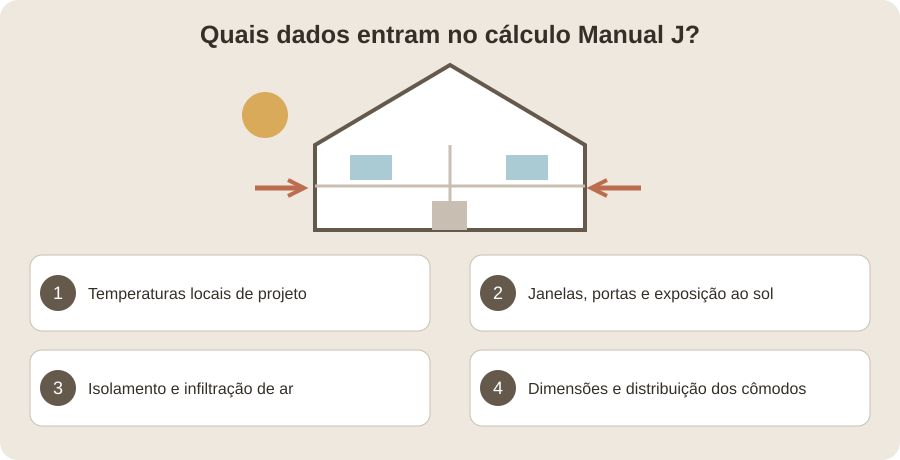
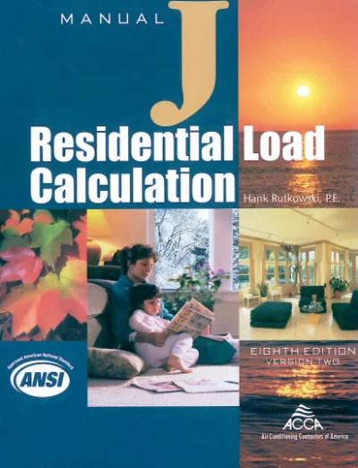
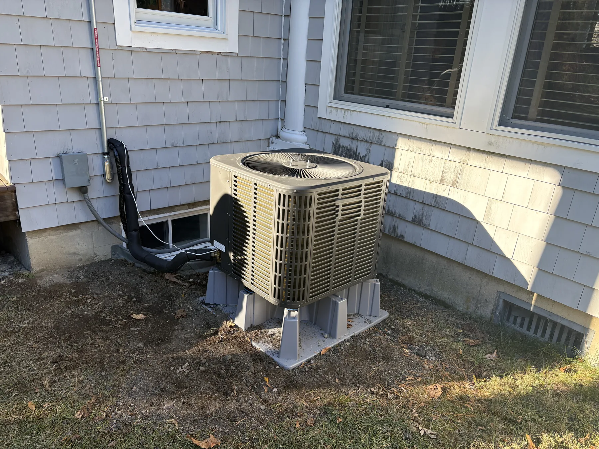
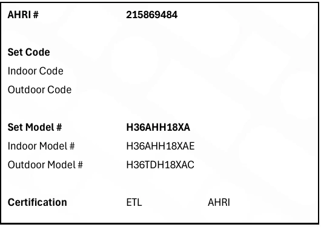
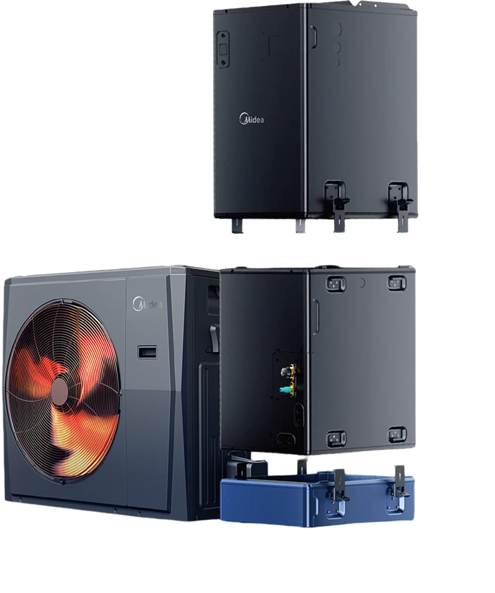
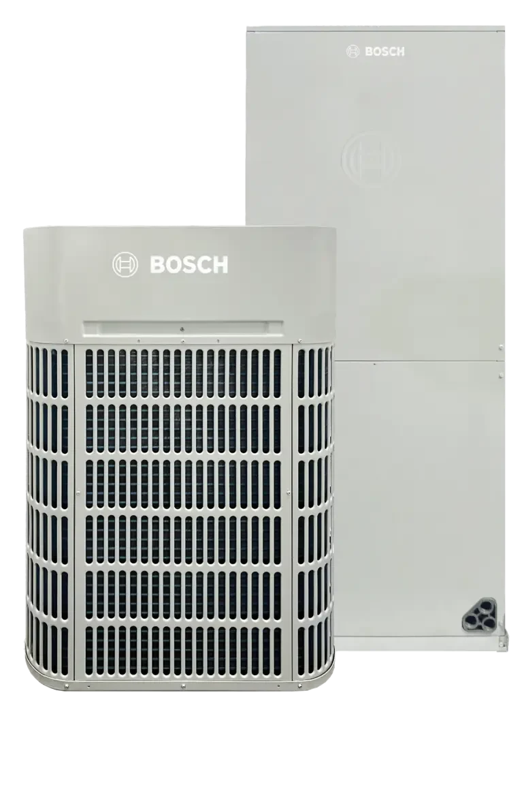
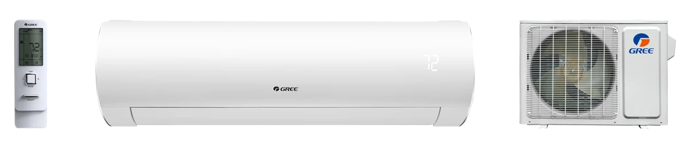
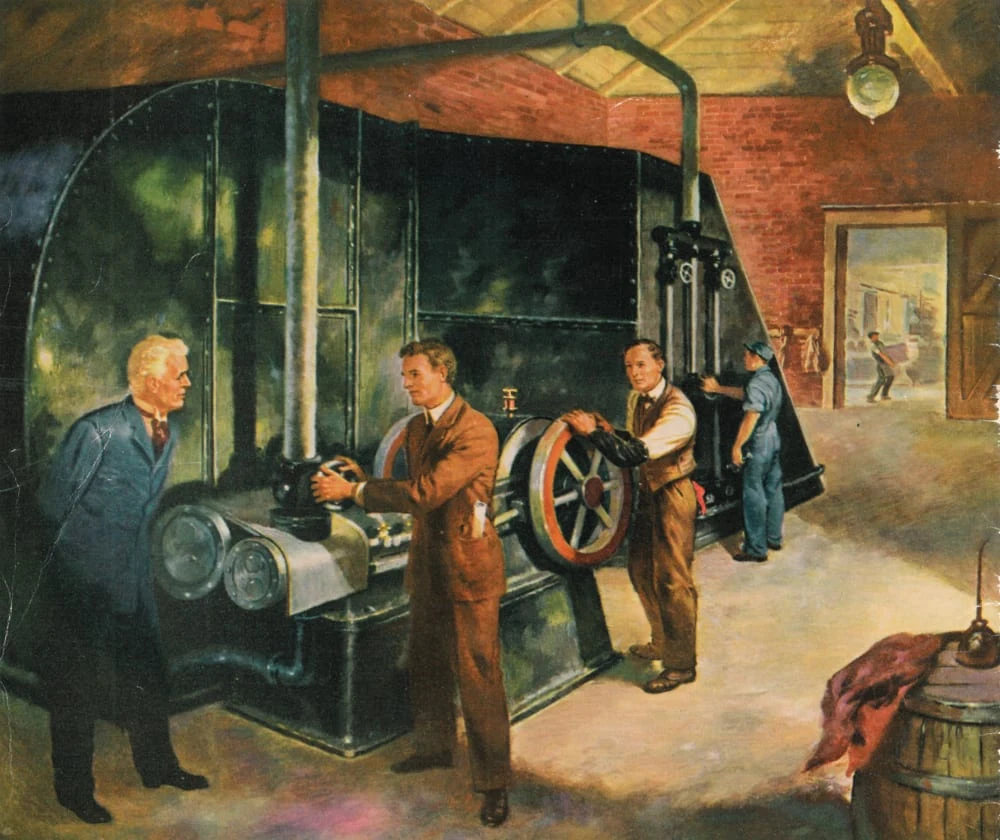
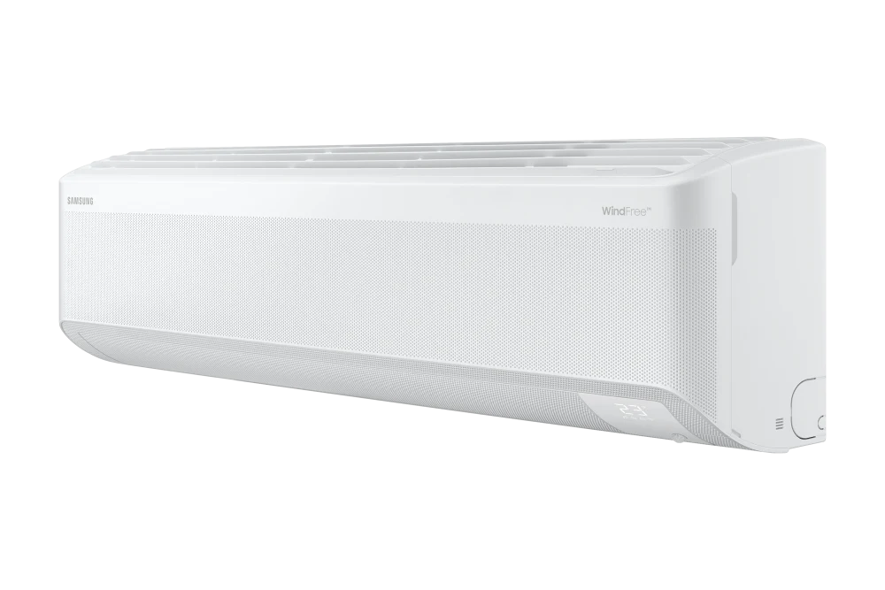
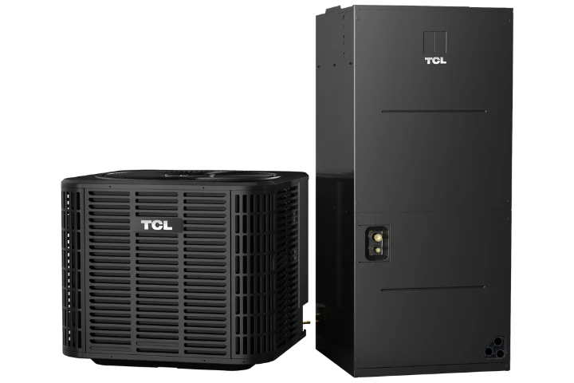

# Guia completo de marcas de bombas de calor e ar-condicionado: história, tecnologia e como escolher

**Aprovado para publicação.**

Escolher uma bomba de calor significa pensar no conforto da casa em janeiro, na refrigeração em julho e em quem dará suporte depois da instalação. A Hanson Home instala bombas de calor de todas as marcas. Neste guia, explicamos os fabricantes por trás dos nomes e compartilhamos recomendações para comparar equipamentos, projetar o sistema e decidir com segurança.

## Resumo: o que importa ao escolher uma marca

Comece pela função do sistema: refrigerar no verão, complementar o aquecimento ou fornecer calor confiável no inverno. Este guia relaciona a história das marcas e as especificações técnicas às decisões que afetam sua casa.

- Uma bomba de calor aquece e refrigera. Escolha uma configuração com dutos, sem dutos ou mista conforme os ambientes atendidos e a distribuição de ar que a casa permite.
- Compare modelos específicos e combinações aprovadas de unidades internas e externas. História, propriedade compartilhada e parcerias de fabricação ajudam a entender o contexto; não tornam todos os produtos equivalentes.
- Para o inverno de Massachusetts, verifique capacidade e eficiência na temperatura de projeto local, capacidade mínima e plano de aquecimento auxiliar. Funcionar em temperatura baixa não garante calor suficiente.
- Compare preço instalado completo, controles, obras elétricas e de dutos, comissionamento, garantia e assistência local. A eficiência sazonal, sozinha, não prevê sua conta de energia.
- A TCL é a marca principal da Hanson Home e recebe mais espaço neste guia. Aplicamos as mesmas verificações por modelo à TCL, Bosch, Midea, Daikin, Mitsubishi Electric e às demais marcas.
- A Hanson Home pode instalar bombas de calor de todas as marcas. Traga suas prioridades de conforto e outros orçamentos para discutirmos as diferenças de equipamento, projeto e assistência para sua casa.

Fontes: [ENERGY STAR: air-source heat-pump buying guidance](https://www.energystar.gov/products/air_source_heat_pumps); [AHRI: how and why equipment is certified](https://www.ahrinet.org/certification/cee-directory/how-and-why-certified); [NEEP: sizing and selecting heat pumps in cold climates](https://neep.org/sites/default/files/resources/ASHP%20Sizing%20%26%20Selecting%20-%208x11_edits.pdf)

A Hanson Home pode instalar bombas de calor de todas as marcas. A TCL é nossa marca principal e recebe mais espaço. Nossas recomendações consideram as necessidades da casa e o equipamento proposto; especificações e histórias empresariais têm suas próprias fontes.

## Comece com um sistema documentado e um plano de assistência

O Manual J utiliza o clima, a envoltória da casa e os dados dos cômodos para calcular as cargas de aquecimento e resfriamento. Peça os resultados por cômodo e as temperaturas de projeto utilizadas. Ilustração da Hanson Home baseada nas orientações da ACCA. [Crédito da imagem / fonte: Hanson Home · ACCA](https://www.acca.org/standards/technical-manuals/manual-j)

O Manual J da ACCA é o método de cálculo de cargas residenciais apresentado aqui. A capa publicada ajuda a identificar a referência para conversar com o instalador. [Crédito da imagem / fonte: ACCA](https://www.acca.org/standards/technical-manuals/manual-j)

Na Hanson Home, recomendamos escolher o sistema adequado à casa, ao plano de aquecimento e às prioridades do proprietário. Primeiro, identifique os cômodos que deseja melhorar, os equipamentos existentes e se precisa refrigerar no verão, complementar o aquecimento ou substituir o sistema atual.

Podemos instalar bombas de calor de todas as marcas, inclusive as deste guia. A TCL é nossa marca principal e recebe mais espaço, mas também explicamos quando outra solução merece atenção. Histórias empresariais e dados vêm das fontes citadas; nossas recomendações mostram como usar essas informações na compra. As fontes não estabelecem um ranking independente e comparável de taxas de falhas entre marcas.

Em Massachusetts, comece com três decisões: apenas refrigeração ou aquecimento significativo no inverno; dutos, unidades por cômodo ou combinação; e manutenção ou retirada do aquecedor ou da caldeira existente. O ENERGY STAR recomenda o cálculo de carga Manual J, enquanto a AHRI explica que os dados certificados pertencem ao conjunto compatível de equipamentos.

- Peça os modelos exatos das unidades internas e externas antes de comparar preços.
- Peça capacidade e eficiência de aquecimento na temperatura de projeto de inverno da casa.
- Pergunte quem fornece peças, solicita a garantia e presta assistência após a instalação.

> Recomendação inicial da Hanson Home: defina o que o sistema precisa fazer antes de escolher o logotipo. Uma boa proposta explica o equipamento e a instalação necessária para funcionar na sua casa.

Fontes: [ENERGY STAR: air-source heat-pump buying guidance](https://www.energystar.gov/products/air_source_heat_pumps); [AHRI: how and why equipment is certified](https://www.ahrinet.org/certification/cee-directory/how-and-why-certified)

## Como funcionam bombas de calor e aparelhos de ar-condicionado

Instalação de bomba de calor na casa de um cliente da Hanson Home. Fotografia de um projeto real fornecida pela Hanson Home. [Crédito da imagem / fonte: Hanson Home](https://hansonhome.us/how-it-works)

O ar-condicionado transfere calor do interior para o exterior. Uma bomba de calor de fonte de ar pode inverter o processo, aquecendo e refrigerando. A eletricidade aciona compressor e ventiladores enquanto o calor é transferido entre os ambientes; isso difere de produzir todo o calor com resistência elétrica.

Sistemas dutados distribuem ar tratado pelos dutos. Sistemas sem dutos usam unidades internas para cômodos ou zonas. Ambos exigem equipamentos adequados e uma forma de levar o ar aos espaços desejados. Uma bomba de calor não se limita a um mini-split de parede.

A Hanson Home recomenda definir a distribuição conforme a casa: dutos e retornos existentes, espaço nas paredes ou no teto, uso dos cômodos, aparência e aquecimento que deseja manter ou substituir. Depois disso, podemos comparar equipamentos de várias marcas.

Fontes: [ENERGY STAR: air-source heat-pump buying guidance](https://www.energystar.gov/products/air_source_heat_pumps)

## Recomendações da Hanson Home para projetos comuns em Massachusetts

Veja como recomendamos reduzir as opções antes de comparar marcas. São orientações de projeto para situações frequentes; a escolha final exige o cálculo de carga da casa e os dados do sistema proposto.

Para aquecimento principal no inverno, priorize a capacidade na temperatura local de projeto em relação à maior eficiência de refrigeração anunciada. Um ótimo aparelho no verão ainda pode depender bastante de aquecimento de apoio. Compare uma opção com melhor desempenho no frio com outra que inclua apoio bem planejado, considerando preço instalado e diferenças de operação.

Em casas com dutos, verifique primeiro se eles entregam a vazão necessária aos cômodos. Se a distribuição funciona, uma bomba de calor compatível pode preservar o interior familiar. Se um andar ou quarto recebe pouco ar, inclua correção dos dutos ou uma zona separada. Trocar só a unidade externa pode deixar o problema original de conforto.

Para ampliações, andares superiores ou casas sem dutos, compare soluções de zona única, múltiplas zonas e dutos compactos com capacidade adequada. Recomendamos verificar a potência mínima e a cobertura com portas fechadas antes de decidir quantas unidades internas comprar. Uma unidade externa grande não é automaticamente a solução mais simples para várias cargas pequenas.

Quando o orçamento é a prioridade, compare propostas completas e pergunte o que o preço maior acrescenta. Recomendamos preservar dimensionamento, drenagem, elétrica e comissionamento adequados, depois avaliar upgrades pelos benefícios documentados de conforto e energia. Os exemplos de custos mostram por que pagar mais por eficiência pode ou não se compensar.

Fontes: [ENERGY STAR: air-source heat-pump buying guidance](https://www.energystar.gov/products/air_source_heat_pumps); [NEEP: sizing and selecting heat pumps in cold climates](https://neep.org/sites/default/files/resources/ASHP%20Sizing%20%26%20Selecting%20-%208x11_edits.pdf); [NEEP: installing heat pumps in cold climates](https://neep.org/sites/default/files/resources/InstallingASHPinCold_edits.pdf)

## Uma breve história dos fabricantes

Identificação da marca: TCL [Crédito da imagem / fonte: TCL North America](https://us.tcl.com/pages/hvac-product-collection)

Identificação da marca: Midea [Crédito da imagem / fonte: Midea Comfort](https://www.mideacomfort.us/g3.html)

Identificação da marca: Bosch [Crédito da imagem / fonte: Bosch Home Comfort](https://www.bosch-homecomfort.com/us/en/ocs/residential/ids-ultra-inverter-ducted-split-cold-climate-heat-pump-20831889-p/)

Identificação da marca: Daikin [Crédito da imagem / fonte: Daikin Comfort Technologies](https://daikincomfort.com/)

Identificação da marca: Panasonic (Sanyo) [Crédito da imagem / fonte: Panasonic Holdings](https://news.panasonic.com/global/)

Identificação da marca: Mitsubishi Electric [Crédito da imagem / fonte: Mitsubishi Electric Trane HVAC US](https://www.mitsubishicomfort.com/metus)

Identificação da marca: GENERAL [Crédito da imagem / fonte: GENERAL Inc.](https://www.generalww.com/global/history/index.html)

Identificação da marca: GREE [Crédito da imagem / fonte: GREE Comfort](https://www.greecomfort.com/our-products/sapphire/)

Identificação da marca: Carrier [Crédito da imagem / fonte: Carrier](https://www.carrier.com/commercial/en/us/about/history/)

Identificação da marca: Samsung HVAC [Crédito da imagem / fonte: Samsung HVAC](https://www.samsunghvac.com/residential/windfree-max-heat)

O ano de fundação de uma empresa e o início da fabricação de ar-condicionado são fatos distintos. Experiência em aquecimento, fabricação de aparelhos para cômodos e parcerias de distribuição nos EUA podem ajudar, mas significam coisas diferentes. Esta cronologia destaca marcos úteis à compra atual, sem premiar apenas a antiguidade.

**Marcos selecionados com fontes primárias**

| Marca ou grupo | Marco relevante | O que significa para o consumidor |
| --- | --- | --- |
| Carrier [3](https://www.carrier.com/commercial/en/us/about/history/) | Ar-condicionado moderno em 1902; empresa fundada em 1915 | Longa trajetória; o fornecimento de sistemas sem dutos ainda exige análise por modelo. |
| Daikin [4](https://www.daikin.com/corporate/overview/summary/history/chronology) | Fundada em 1924; AC compacto em 1951; bomba de calor compacta em 1958 | Experiência em refrigeração e climatização com e sem dutos. |
| Mitsubishi Electric [5](https://www.mitsubishielectric.com/bu/air-conditioning-systems/history/) | Fundada em 1921; fábrica especializada em AC em 1954; split de parede em 1968 | Décadas em sistemas para cômodos; o suporte americano tem estrutura de joint venture. |
| Sanyo / Panasonic [6](https://www.panasonic.com/global/hvac-cc/about/history/hvac.html), [15](https://holdings.panasonic/global/corporate/about/history/chronicle/2011.html) | Origens da Sanyo em 1947; AC da Panasonic em 1957; aquisição completa em 2011 | Equipamentos Sanyo antigos exigem verificar assistência do modelo específico. |
| GENERAL, antiga Fujitsu General [7](https://www.generalww.com/global/history/index.html), [20](https://www.generalww.com/global/info/20260101/index.html) | Primeiro AC de janela em 1960; mudança de nome em 2026 | Nomes anteriores podem continuar em produtos e documentos durante a transição. |
| Midea [8](https://www.midea.com/vn-en/brandstory) | Fundada em 1968; entrada em AC em 1985 | Além da própria marca, possui relações documentadas de fornecimento e parceria. |
| Gree [9](https://global.gree.com/usa/channels/735.html) | Fundada em 1991 com produção de AC residencial | Trajetória dedicada ao AC; confira cada geração americana. |
| TCL [10](https://us.tcl.com/pages/hvac-about-us) | Divisão de ar-condicionado estabelecida em 1999 | Experiência em climatização anterior à recente expansão no varejo norte-americano. |
| LG [24](https://www.lg.com/ph/about-lg/press-and-media/lg-electronics-launches-the-brand-new-line-up-for-single-commercial-air-conditioners/) | Origens no AC residencial em 1968 | A fama em eletrônicos é apenas parte da trajetória em climatização. |

## Quem fabrica o equipamento e quais relações distinguir

Trecho da ficha TCL: referência AHRI e modelos interno e externo. Peça ao instalador que confira a combinação exata e o certificado vigente no diretório AHRI. [Crédito da imagem / fonte: TCL North America](https://cdn.shopify.com/s/files/1/0687/7151/2385/files/Submittal_Sheet_-_AHU_-_36K_230V.pdf?v=1764127657)

Propriedade da marca identifica quem controla o nome. O OEM fabrica equipamentos; o vendedor de marca própria comercializa sob seu rótulo. Uma joint venture combina negócios ou capacidades definidos. Um fornecedor pode produzir o compressor ou ventilador sem projetar, montar ou garantir todo o sistema. Essas relações não tornam automaticamente duas marcas iguais.

A certificação AHRI aceita OEMs e vendedores de marca própria. Os registros de conjuntos compatíveis ajudam a confirmar a combinação, mas são registros de desempenho, não um mapa completo da fábrica, firmware, assistência ou peças intercambiáveis.

Nossa interpretação: compartilhar fabricação pode gerar valor, mas a compra inclui controles, distribuição e garantia do vendedor. Se afirmarem que duas unidades são idênticas, peça provas escritas dos modelos. Gabinetes parecidos, o mesmo compressor ou conversas na internet não comprovam desempenho igual nem compatibilidade de peças.

> Compare o que receberá e quem dará suporte. A relação de fabricação é contexto, não substitui o número do modelo.

Fontes: [AHRI: how and why equipment is certified](https://www.ahrinet.org/certification/cee-directory/how-and-why-certified)

## Midea como fabricante consolidado e fornecedor

Imagem do sistema com dutos Midea EVOX G3. Confira os modelos internos e externos exatos no orçamento. [Crédito da imagem / fonte: Midea Comfort](https://www.mideacomfort.us/g3.html)

A Midea situa suas origens em 1968 e sua entrada em ar-condicionado em 1985. Sua divisão Building Technologies registra VRF com tecnologia Toshiba-Carrier em 1999, parceria VRF com Bosch em 2015 e aquisição da Clivet em 2016. São relações específicas, não evidências de que todas as marcas associadas vendam o mesmo equipamento residencial.

O comunicado da Carrier sobre sua joint venture norte-americana sem dutos descreve a Midea como fornecedora global de longa data de sistemas residenciais sem dutos. Uma marca pouco conhecida no varejo pode, portanto, pertencer a uma empresa já presente por trás de nomes familiares.

Em um orçamento Midea, diferencie um aparelho para cômodo de um sistema dutado ou sem dutos instalado profissionalmente. Peça a família americana, certificação do conjunto, controles e fornecimento local de peças. Uma oferta com marca Midea merece avaliação pelos documentos e escopo instalado; o histórico como fornecedora não prova maior confiabilidade ou economia específica.

> A Hanson Home recomenda incluir uma Midea documentada na comparação de custo-benefício quando capacidade no frio, controles e assistência atendem ao projeto. Compare o escopo completo; escala industrial não decide sozinha.

Fontes: [Midea: brand history](https://www.midea.com/vn-en/brandstory); [Midea Building Technologies: history and partnerships](https://hvac.midea.com/about_mbt/); [Carrier: North American residential ductless partnership with Midea](https://www.carrier.com/carrier/en/worldwide/news/news-article/carrier--midea-launch-residential-ductless-hvac-joint-venture-in-north-america.html)

## O que a parceria oficial entre Bosch e Midea comprova

Em 31 de março de 2015, a Bosch anunciou uma joint venture com Midea Commercial Air-Conditioner Division para fabricar sistemas de fluxo variável de refrigerante, VRF, em Hefei, China. O comunicado descreve pesquisa e desenvolvimento conjuntos, distribuição principalmente Bosch, aplicações comerciais e produção prevista para janeiro de 2016. A Midea também registra essa joint venture em sua história.

Isso confirma colaboração na fabricação de climatização com marca Bosch. O comunicado não identifica todos os modelos residenciais IDS nos EUA nem comprova que todas as bombas Bosch sejam Midea com outro rótulo. Analise a geração e o conjunto IDS específicos, sem usar um anúncio comercial VRF como mapa universal de produção.

Fontes: [Bosch: Midea VRF joint-venture announcement, March 31, 2015](https://www.bosch-presse.de/pressportal/de/bosch-und-midea-vereinbaren-joint-venture-fuer-die-fertigung-von-vrf-systemen-42920.html); [Midea Building Technologies: history and partnerships](https://hvac.midea.com/about_mbt/)

## Bosch atualmente e as gerações IDS

Unidade externa e unidade de tratamento de ar Bosch IDS Ultra. Confira as especificações da combinação selecionada. [Crédito da imagem / fonte: Bosch Home Comfort](https://www.bosch-homecomfort.com/us/en/ocs/residential/ids-ultra-inverter-ducted-split-cold-climate-heat-pump-20831889-p/)

O negócio da Bosch mudou ao concluir as aquisições das operações residenciais e comerciais leves da Johnson Controls e da Johnson Controls–Hitachi Air Conditioning em 31 de julho de 2025. O comunicado inclui licenças de longo prazo das marcas YORK e Hitachi. Isso não torna um YORK intercambiável com um Bosch IDS existente.

A Bosch descreve injeção de vapor aprimorada no IDS Ultra e publica até 19 SEER2, 10 HSPF2 e 100% da capacidade de aquecimento a 5°F com COP 2.1. Também distingue a continuidade de aquecimento em temperaturas inferiores. São declarações da família Ultra, não de IDS Light ou gerações antigas.

Uma oferta IDS pode ser interessante para adaptar dutos, mas o sufixo da família importa. Compare potência no frio, unidade interna aprovada, vazão e instruções do termostato. Um preço atraente de outra geração não equivale à combinação proposta para clima frio.

> A Hanson Home recomenda comparar a geração IDS exata com dutos, unidade interna e plano de apoio. Considere Ultra quando seu desempenho verificado agrega valor; não presuma desempenho Ultra em outra categoria IDS.

Fontes: [Bosch: completion of Johnson Controls / Hitachi HVAC acquisition](https://www.bosch-presse.de/pressportal/us/en/press-release-28096.html); [Bosch: IDS Ultra technical overview](https://www.bosch-homecomfort.com/us/en/ocs/residential/ids-ultra-inverter-ducted-split-cold-climate-heat-pump-20831889-p/)

## Sanyo, Panasonic e o suporte de sistemas antigos

A Panasonic registra as origens da Sanyo em 1947, seu próprio negócio de AC em 1957 e o primeiro aparelho para cômodo em 1958. Tornou a Sanyo integralmente sua em abril de 2011. Um comunicado de setembro confirmou a integração da equipe HVAC norte-americana em 1º de outubro de 2011.

Para um mini-split Sanyo antigo, importa a assistência daquele modelo. Antes de autorizar reparo, verifique placas, sensores, motores e componentes de refrigeração disponíveis; compare o valor total com um sistema substituto corretamente projetado.

Para uma compra nova, identifique modelo Panasonic americano atual e distribuidor. A Sanyo fornece contexto histórico e uma questão de manutenção, mas não permite presumir que uma unidade Panasonic moderna conectará a uma externa Sanyo antiga. Exija combinação aprovada pelo fabricante e garantia vigente.

> A Hanson Home recomenda confirmar peças e custo total antes de substituir um Sanyo. Se a troca for adequada, revise cargas e distribuição em vez de repetir automaticamente o tamanho nominal anterior.

Fontes: [Panasonic: HVAC business history](https://www.panasonic.com/global/hvac-cc/about/history/hvac.html); [Panasonic: Sanyo becomes wholly owned, April 2011](https://holdings.panasonic/global/corporate/about/history/chronicle/2011.html); [Panasonic press release: Sanyo North American HVAC integration](https://www.prnewswire.com/news-releases/panasonic-incorporates-sanyo-hvac-unit-into-north-american-operations-129448098.html)

## Daikin, Goodman e Amana no mercado americano

A Daikin tem origens em 1924, AC compacto em 1951, bomba de calor compacta em 1958 e multisplit comercial em 1982. Comprar a Goodman em 2012 ampliou seu negócio residencial dutado na América do Norte. O anúncio de 2022 descreve consolidação industrial no Texas em 2017 e o nome Daikin Comfort Technologies North America a partir de 1º de abril de 2022.

O anúncio manteve Goodman e Amana como marcas de produto. Compará-las com Daikin exige mais nuance do que comparar empresas independentes. Propriedade comum não significa compressor, eficiência, controle e garantia iguais. Compare a categoria e a combinação instalada.

A ficha atual Daikin identifica modelos com controles comunicantes. Compare o pacote completo de unidades e controles com uma opção de termostato convencional. Pergunte quais funções dependem do controlador, quanto custa substituí-lo e quem pode diagnosticar o sistema.

Fontes: [Daikin: corporate chronology](https://www.daikin.com/corporate/overview/summary/history/chronology); [Daikin: Goodman subsidiary name change, March 2022](https://www.daikin.com/press/2022/20220311); [Daikin: R-32 split-system heat-pump comparison, May 2026](https://daikincomfort.com/docs/default-source/general/general/pf-hpsplits_r32.pdf)

## As categorias da Daikin mostram a importância do modelo

A ficha R-32 de maio de 2026 lista DH9VS com até 21 SEER2 e 10 HSPF2 e DH7VS com até 19 SEER2 e 8.8 HSPF2. Ambos usam compressores swing de velocidade variável e controles comunicantes; somente DH9VS é identificado como atendendo ao DOE Cold Climate Heat Pump Challenge.

A mesma ficha distingue modelos variáveis de equipamentos de dois estágios e outros compressores scroll. São diferenças de projeto dentro da marca. O Challenge é um programa específico; ter ou não sua identificação não dimensiona o sistema para a casa.

Um modelo econômico de marca respeitada pode servir à refrigeração ou aquecimento complementar, enquanto aquecimento principal pode justificar outra categoria. Peça tabelas de baixa temperatura do conjunto. Nem reputação nem a palavra inverter garantem capacidade invernal igual em toda a gama.

> A Hanson Home recomenda perguntar como as diferenças entre categorias Daikin afetam sua aplicação. Aquecimento principal pode justificar outra escolha por capacidade no frio e controles completos.

Fontes: [Daikin: R-32 split-system heat-pump comparison, May 2026](https://daikincomfort.com/docs/default-source/general/general/pf-hpsplits_r32.pdf)

## Mitsubishi Electric, Trane e American Standard e as marcas conjuntas

A Mitsubishi Electric registra fábrica especializada de AC em 1954 e split Kirigamine de parede em 1968. Mitsubishi Electric Trane HVAC US, METUS, surgiu em 2018 como joint venture 50/50. Suas marcas incluem Mitsubishi Electric, Trane/Mitsubishi Electric e American Standard/Mitsubishi Electric.

Identifique separadamente a oferta sem dutos de marca conjunta e outros produtos Trane ou American Standard. Logotipos relacionados não comprovam arquitetura igual em todos os aparelhos centrais e sem dutos.

O anúncio METUS de abril de 2026 para SMART MULTI H2i de cinco toneladas informa 100% de aquecimento a 5°F, 80% a −13°F e bloqueio a −24°F. São três conceitos distintos, não especificações universais de todos os aparelhos Mitsubishi Electric.

Compare zonas, potência mínima, combinações internas permitidas e controles. O nome de uma tecnologia para clima frio é apenas o começo; os dados precisam mostrar como o conjunto atende cada cômodo.

> A Hanson Home recomenda incluir uma Mitsubishi Electric documentada quando aquecimento em baixa temperatura ou determinada distribuição interna forem prioritários. Examine a capacidade mínima e cômodos conectados tão cuidadosamente quanto o máximo de inverno.

Fontes: [Mitsubishi Electric: air-conditioning history](https://www.mitsubishielectric.com/bu/air-conditioning-systems/history/); [Mitsubishi Electric Trane HVAC US: brands, ownership and warranty conditions](https://www.mitsubishicomfort.com/metus); [METUS: 2026 five-ton SMART MULTI H2i launch](https://www.mitsubishicomfort.com/press-releases/SMART-MULTI-5tonH2i-release-2026)

## Fujitsu General, GENERAL e Rheem e a mudança de nome

A empresa hoje chamada GENERAL lançou seu primeiro AC de janela em 1960. Em agosto de 2025, a Fujitsu General anunciou a entrada no grupo Paloma Rheem e a colaboração norte-americana com Rheem desde 2016, incluindo fornecimento e desenvolvimento.

Desde 1º de janeiro de 2026, a razão social é GENERAL Inc. A marca FUJITSU no exterior fará transição gradual; equipamentos, folhetos e site podem mostrar nomes diferentes.

Avalie o produto americano e seus documentos de suporte, sem tratar uma mudança de nome como um fabricante novo. Pergunte quem emite a garantia, qual é o registro e quem fornece peças. A propriedade comum não torna todos os Rheem e GENERAL o mesmo sistema.

> A Hanson Home recomenda comparar o conjunto GENERAL/Fujitsu e seu suporte com outras opções sem dutos. A mudança pede conferência documental, não rejeição automática de equipamento adequado.

Fontes: [GENERAL: company and air-conditioning history](https://www.generalww.com/global/history/index.html); [Fujitsu General: joins Paloma Rheem group, August 22, 2025](https://www.generalww.com/global/news/2025/0822/nr20250822-1.pdf); [GENERAL: January 1, 2026 corporate name change](https://www.generalww.com/global/info/20260101/index.html)

## Gree e diferenças entre gerações

Sistema sem dutos GREE Sapphire da página citada. Confirme a geração do modelo e o refrigerante oferecido. [Crédito da imagem / fonte: GREE Comfort](https://www.greecomfort.com/our-products/sapphire/)

A Gree registra fundação em 1991 e início na montagem e produção residencial. Sua página americana Sapphire combina SEER2/HSPF2 com publicidade antiga SEER/HSPF e documentos de modelos específicos. Usar apenas o maior número pode misturar métodos de classificação ou gerações.

Sapphire anuncia operação de aquecimento até −22°F. O limite indica se pode operar, mas não revela potência térmica, consumo nem parcela da carga da casa atendida ali.

Avalie Gree por modelo como qualquer fabricante. Peça ficha e dados estendidos do conjunto americano, geração de refrigerante e caminho de garantia e peças do distribuidor. Confira se a documentação on-line corresponde ao que será instalado.

> A Hanson Home recomenda considerar Gree quando o modelo exato oferece a capacidade necessária e assistência local clara. Compare métodos e gerações equivalentes usando documentos atuais.

Fontes: [Gree: corporate profile](https://global.gree.com/usa/channels/735.html); [Gree Comfort: Sapphire documents and performance claims](https://www.greecomfort.com/our-products/sapphire/)

## Carrier e sua parceria documentada de sistemas sem dutos

O arquivo da Carrier associa esta imagem à instalação de ar-condicionado de Sackett & Wilhelms de 1902. Ela mostra as origens industriais da marca atual. [Crédito da imagem / fonte: Carrier](https://www.carrier.com/commercial/en/us/about/history/)

A Carrier vincula sua história ao ar-condicionado moderno de Willis Carrier em 1902 e à fundação de 1915. O anúncio de joint venture explica outro negócio: sua rede de distribuição combina-se com o desenvolvimento sem dutos da Midea sobre uma parceria antiga de fornecimento.

A trajetória pode ajudar a avaliar o canal de assistência, mas a família define a comparação técnica. Se a oferta inclui Carrier central e sem dutos, peça documentação e garantias de ambos. Nem marca compartilhada nem vínculo com Midea comprovam peças universalmente intercambiáveis.

Fontes: [Carrier: history of modern air conditioning](https://www.carrier.com/commercial/en/us/about/history/); [Carrier: North American residential ductless partnership with Midea](https://www.carrier.com/carrier/en/worldwide/news/news-article/carrier--midea-launch-residential-ductless-hvac-joint-venture-in-north-america.html)

## LG, Samsung e Lennox e as opções de conforto

Unidade interna Samsung WindFree publicada na página Max Heat. Confira a unidade externa correspondente e o projeto do ambiente. [Crédito da imagem / fonte: Samsung HVAC](https://www.samsunghvac.com/residential/windfree-max-heat)

A LG situa suas origens residenciais em 1968. A página americana informa que certos LGRED entregam 100% de aquecimento a 5°F, operam até −13°F e oferecem vários formatos internos. Isso importa quando aparência, espaço no teto ou direção do ar influenciam o projeto.

Samsung WindFree Max Heat anuncia 100% de desempenho de aquecimento a 5°F, aquecedor de bandeja integrado e refrigeração por pequenos orifícios. A sensação de fluxo mais suave deve ser avaliada junto com dados de aquecimento e cobertura, sem substituí-los.

A Lennox confirma a criação de Samsung Lennox HVAC North America em 2024 e ofertas sem dutos e VRF Lennox Powered by Samsung. Pergunte qual distribuição e garantia acompanham Samsung ou marca conjunta. Não estenda uma função de determinada família a todos os aparelhos Lennox.

> A Hanson Home recomenda examinar unidades LG ou Samsung específicas se aparência ou conforto do fluxo forem decisivos. Inclua capacidade de aquecimento, comportamento dos controles e assistência.

Fontes: [LG: history of its residential air-conditioning business](https://www.lg.com/ph/about-lg/press-and-media/lg-electronics-launches-the-brand-new-line-up-for-single-commercial-air-conditioners/); [LG USA: residential HVAC systems and LGRED](https://www.lg.com/us/residential-hvac/hvac-systems); [Samsung HVAC: WindFree Max Heat](https://www.samsunghvac.com/residential/windfree-max-heat); [Lennox: Lennox Powered by Samsung product launch](https://www.investor.lennox.com/news-releases/news-release-details/lennox-debuts-lennox-powered-samsung-mini-split-and-vrf-product)

## A experiência da TCL em climatização é anterior à expansão recente no varejo

Imagem da linha TCL Advantage. Compare o equipamento proposto com sua ficha técnica e registro AHRI. [Crédito da imagem / fonte: TCL North America](https://us.tcl.com/pages/hvac-product-collection)

A história da TCL na América do Norte situa a criação de sua divisão de ar-condicionado em 1999. Seu catálogo atual inclui as famílias Advantage, Multi Match e outras.

A TCL é a marca principal da Hanson Home, mas instalamos outras marcas. Use as mesmas perguntas de Bosch, Daikin ou Mitsubishi Electric: o conjunto cobre a carga, controles e unidades internas combinam com a casa, e instalação e assistência são claras?

Uma proposta TCL deve indicar todos os modelos, classificação do conjunto, faixa de operação, apoio quando necessário, elétrica e controles. Se diz só “TCL inverter” ou cita o máximo de outra família, peça documentação específica antes de decidir.

> A Hanson Home recomenda TCL quando a combinação atende à casa e ao orçamento. Se capacidade no frio ou configuração não atenderem, compare outro conjunto ou marca. As especificações devem explicar a escolha.

Fontes: [TCL North America: HVAC division history](https://us.tcl.com/pages/hvac-about-us); [TCL North America: HVAC product collection](https://us.tcl.com/pages/hvac-product-collection)

## Mini-splits TCL na Home Depot

O relatório anual de 2025 da TCL Industries informa que o negócio de ar-condicionado entrou em canais de varejo na América do Norte, incluindo a Home Depot. A categoria de mini-splits TCL da Home Depot lista sistemas sem dutos; alguns anúncios informam disponibilidade de instalação profissional.

Essas listagens de varejo dão aos proprietários um exemplo concreto da linha de mini-splits TCL disponível no comércio. O modelo escolhido e o escopo completo da instalação determinam a capacidade no inverno, os ambientes atendidos, os controles e a assistência.

Compare o preço do equipamento no varejo com um orçamento profissional somente quando o escopo for equivalente: projeto, unidades internas, elétrica, tubulação de refrigerante, drenagem, licenças, comissionamento e assistência.

Fontes: [TCL Industries: 2025 annual report, pp. 31–32](https://static-obg.tcl.com/content/dam/brandsite/region/china/pdf/report2025en-20260429.pdf); [Home Depot: TCL mini-split air conditioners](https://www.homedepot.com/b/Heating-Venting-Cooling-Mini-Split-Air-Conditioners/TCL/N-5yc1vZc4m1Zals)
## Como ler a ficha TCL e por que três toneladas não dizem tudo

A ficha Advantage do conjunto interno H36AHH18XAE e externo H36TDH18XAC apresenta os valores abaixo e AHRI 215869484. É um exemplo documental, não indicação universal para casas ou toda a linha TCL. O instalador deve conferir certificado atual e versões fornecidas.

**Conjunto TCL Advantage publicado: H36AHH18XAE + H36TDH18XAC**

| Medida | Valor publicado | Como utilizar |
| --- | --- | --- |
| Refrigeração e aquecimento sazonais | 19 SEER2 / 9 HSPF2-4 | Compare métodos iguais e conjuntos completos. |
| Refrigeração a 95°F | 34,000 BTU/h | Compare com a carga de projeto de refrigeração. |
| Aquecimento a 47°F | 36,000 BTU/h; COP 3.2 | Um ponto mais ameno não determina a capacidade máxima invernal. |
| Aquecimento a 5°F | 26,000 BTU/h; COP 1.9 | Compare com a carga nessa temperatura. |
| Faixa externa de aquecimento | −5°F a 80°F | Faixa operacional não é garantia de capacidade. |
| Controles e refrigerante | 24VAC ou TCL RS485; R-454B | Confirme configuração escolhida e peças aprovadas. |

> Nosso cálculo: 26,000 ÷ 36,000 é aproximadamente 72%. O valor a 5°F corresponde a cerca de 72% da capacidade a 47°F; tamanho nominal não promete esse desempenho em toda temperatura.

Fontes: [TCL: Advantage H36AHH18XAE / H36TDH18XAC submittal, pp. 1–2](https://cdn.shopify.com/s/files/1/0687/7151/2385/files/Submittal_Sheet_-_AHU_-_36K_230V.pdf?v=1764127657)

## Como a Hanson Home usaria os dados TCL no projeto

Imagine uma casa que precisa de 32,000 BTU/h a 5°F. Se o sistema entrega 26,000 nessa condição, faltam 6,000 BTU/h. O instalador deve explicar como cobrir a diferença: outra combinação aprovada, equipamento adicional ou apoio planejado. É um exemplo, não avaliação real de um cliente.

Uma zona que precisa de 22,000 BTU/h na mesma condição pode ser atendida, sujeito ao ensaio do fabricante, correções de tubulação, degelo e distribuição. O objetivo é verificar adequação em vez de julgar toda a marca TCL.

Peça essa comparação à Hanson Home para TCL ou outra marca. Solicite explicação dos modelos, capacidade no inverno e carga restante, depois instalação e apoio. Revise garantia, mão de obra, registro e contato de assistência junto com dutos, drenagem e elétrica.

> Um sistema pode servir uma casa e exigir outro projeto em outra. Carga e proposta completa determinam a diferença.

Fontes: [TCL: Advantage H36AHH18XAE / H36TDH18XAC submittal, pp. 1–2](https://cdn.shopify.com/s/files/1/0687/7151/2385/files/Submittal_Sheet_-_AHU_-_36K_230V.pdf?v=1764127657)

## Exemplos técnicos entre marcas e limites das declarações

Os exemplos mostram informações de famílias ou conjuntos, não testes controlados de comparação direta. Tamanhos, unidades e condições diferem; máximos podem vir de configurações distintas. Não use como ranking de preço, confiabilidade ou eficiência.

**Exemplos conferidos em 29 de setembro de 2026**

| Exemplo | Informação do fabricante | Pergunta ao instalador |
| --- | --- | --- |
| TCL Advantage H36 [30](https://cdn.shopify.com/s/files/1/0687/7151/2385/files/Submittal_Sheet_-_AHU_-_36K_230V.pdf?v=1764127657) | 26,000 BTU/h a 5°F; COP 1.9 | Cobre a carga calculada da zona? |
| Família Bosch IDS Ultra [32](https://www.bosch-homecomfort.com/us/en/ocs/residential/ids-ultra-inverter-ducted-split-cold-climate-heat-pump-20831889-p/) | Até 100% a 5°F / COP 2.1; até 19 SEER2 e 10 HSPF2 | Qual conjunto fornece esses valores? |
| Família Daikin DH7VS [40](https://daikincomfort.com/docs/default-source/general/general/pf-hpsplits_r32.pdf) | Até 19 SEER2 / 8.8 HSPF2; R-32 e controles comunicantes | Qual é a capacidade mínima e no frio do conjunto? |
| Família Midea EVOX G3 [31](https://www.mideacomfort.us/g3.html) | Até 19 SEER2, 10.8 HSPF2-4 e COP 2.14 a 5°F | Os modelos escolhidos atingem os mesmos valores? |
| Mitsubishi Electric SMART MULTI H2i de cinco toneladas de 2026 [19](https://www.mitsubishicomfort.com/press-releases/SMART-MULTI-5tonH2i-release-2026) | 100% a 5°F; 80% a −13°F; bloqueio a −24°F | Qual capacidade chega às unidades internas conectadas? |
| Modelos LGRED selecionados [23](https://www.lg.com/us/residential-hvac/hvac-systems) | 100% de aquecimento a 5°F; operação até −13°F | Qual modelo, capacidade e combinação interna se aplicam? |
| Samsung WindFree Max Heat [25](https://www.samsunghvac.com/residential/windfree-max-heat) | 100% de aquecimento a 5°F; aquecedor de bandeja integrado | Quais capacidade, consumo e correções existem na condição de projeto? |

## SEER2, EER2, HSPF2 e COP respondem a perguntas diferentes

SEER2 indica eficiência sazonal de refrigeração; EER2, eficiência em condição definida; HSPF2, eficiência sazonal de aquecimento. O DOE usa os indicadores revisados “2” nas normas de 2023. Compare mesma métrica e base. Não classifique SEER/HSPF antigos ao lado de SEER2/HSPF2 sem conversão adequada e contexto.

COP compara calor entregue com energia elétrica na condição definida, usando unidades consistentes. COP 2 significa duas unidades de calor para cada unidade elétrica. É útil em um ponto de frio, não uma previsão da conta anual.

Pergunte se capacidade/COP corresponde a velocidade nominal, mínima ou máxima. As ferramentas NEEP comparam potência e carga da casa. Boa pontuação sazonal e capacidade máxima podem coexistir com desempenho diferente nas condições reais de uso.

Recomendamos separar indicadores sazonais e dados de projeto de inverno. Quem prioriza refrigeração pode dar mais peso a SEER2; para aquecimento, inclua capacidade no frio, consumo e apoio junto com HSPF2.

Fontes: [DOE: 2023 central AC and heat-pump standards FAQ](https://www1.eere.energy.gov/buildings/appliance_standards/pdfs/2023_CAC_Standards_FAQ_10-5-2022_Final.pdf); [NEEP: cold-climate sizing support tools](https://neep.org/blog/not-too-big-not-too-small-new-tools-improved-air-source-heat-pump-selection)

## Capacidade no frio, injeção de vapor e equilíbrio térmico

Demanda da casa e capacidade da bomba mudam com o clima. A NEEP recomenda dados próximos à condição externa de projeto. A temperatura em que potência e carga se igualam é o ponto de equilíbrio térmico; abaixo dele, o projeto precisa cobrir eventual déficit.

A Bosch descreve injeção de vapor aprimorada no Ultra; METUS, injeção flash no SMART MULTI de 2026. Ajudam no frio, mas não bastam para dimensionar: as tabelas de potência térmica e elétrica continuam essenciais.

Em Massachusetts, “aquece até −22°F” não significa “cobre a carga calculada a −22°F”. Peça temperatura externa e interna de projeto, carga e calor disponível. Litoral e interior não devem usar automaticamente a mesma hipótese climática.

Pergunte como o projeto considera degelo e apoio. O mínimo de operação anunciado não comprova cobertura completa, ausência de aquecimento auxiliar nem custo baixo.

Fontes: [NEEP: sizing and selecting heat pumps in cold climates](https://neep.org/sites/default/files/resources/ASHP%20Sizing%20%26%20Selecting%20-%208x11_edits.pdf); [Bosch: IDS Ultra technical overview](https://www.bosch-homecomfort.com/us/en/ocs/residential/ids-ultra-inverter-ducted-split-cold-climate-heat-pump-20831889-p/); [METUS: 2026 five-ton SMART MULTI H2i launch](https://www.mitsubishicomfort.com/press-releases/SMART-MULTI-5tonH2i-release-2026)

## Potência mínima e zonas

Um compressor inverter varia a potência, mas possui capacidade mínima estável. A NEEP destaca esse critério e alerta contra escolher multizona apenas pelo número de cômodos. Superdimensionamento pode deixar potência excessiva quando a demanda é pequena.

Exemplo: um quarto precisa de 2,000 BTU/h em um dia ameno e a unidade externa não opera de forma estável abaixo de 8,000. Grande capacidade máxima não corrige a diferença. Pergunte como o sistema atende só esse quarto e como as outras unidades se comportam.

Compare vários sistemas de zona única, um multizona menor e uma unidade compacta dutada para cômodos pequenos. Avalie espaço, tubulações, aparência, potência mínima, acesso para manutenção e funcionamento durante reparos.

No verão, confira potência mínima de refrigeração e umidade. Atingir rapidamente a temperatura não garante a melhor desumidificação. Cargas por cômodo tornam a discussão mais concreta.

Fontes: [NEEP: sizing and selecting heat pumps in cold climates](https://neep.org/sites/default/files/resources/ASHP%20Sizing%20%26%20Selecting%20-%208x11_edits.pdf); [Bosch: R-454B air-to-air product FAQs](https://www.bosch-homecomfort.com/us/en/residential/service-support/technical-support/frequently-asked-questions/air-to-air-r-454b-heat-pump-systems-faq/)

## Dutos e controles influenciam o resultado

Em adaptações dutadas, avalie vazão e pressão estática externa, a resistência enfrentada pelo ventilador. Nova unidade externa não corrige retornos insuficientes nem todo problema de dutos. A Bosch relaciona conforto com tamanho, distribuição, pressão e controles.

IDS Light não exige termostato comunicante e aceita a maioria dos 24VAC; EVOX G3 oferece 24V/485; o Advantage citado admite 24VAC e TCL RS485; a Daikin identifica modelos comunicantes. São exemplos específicos, não regras universais da marca.

Pergunte se o termostato antigo serve, o que muda ao mantê-lo, quem controla ventilador e apoio, se funciona sem Wi-Fi e se inclui sensor remoto. Discuta custos de reposição dos controles e sensores.

O orçamento deve nomear termostato, interfaces e sequência de apoio. Em multizona, pergunte o que ocorre quando um cômodo pede calor e outro frio; ajustes independentes não garantem modos simultâneos irrestritos.

> A Hanson Home recomenda incluir correções de dutos, interfaces e controle de apoio. Um preço menor perde vantagem se omitir itens necessários.

Fontes: [Bosch: R-454B air-to-air product FAQs](https://www.bosch-homecomfort.com/us/en/residential/service-support/technical-support/frequently-asked-questions/air-to-air-r-454b-heat-pump-systems-faq/); [Midea Comfort: EVOX G3 specifications](https://www.mideacomfort.us/g3.html); [TCL: Advantage H36AHH18XAE / H36TDH18XAC submittal, pp. 1–2](https://cdn.shopify.com/s/files/1/0687/7151/2385/files/Submittal_Sheet_-_AHU_-_36K_230V.pdf?v=1764127657); [Daikin: R-32 split-system heat-pump comparison, May 2026](https://daikincomfort.com/docs/default-source/general/general/pf-hpsplits_r32.pdf)

## O que comparar entre R-32 e R-454B

A EPA lista R-32 e R-454B como A2L sujeitos a condições. Na referência Technology Transitions, seus potenciais de aquecimento global são 675 e 465, contra 2,088 para R-410A. Use a mesma base; outras avaliações podem trazer pequenas diferenças.

A2L é classificação de segurança, não de eficiência. Equipamento e instalação precisam ser adequados ao refrigerante. Menor GWP não significa automaticamente COP maior, menos ruído ou conta menor; isso depende do sistema e das condições.

Pergunte qual refrigerante será usado, quais cuidados o manual exige e se o instalador tem treinamento e ferramentas. Compare assistência e peças aprovadas com impacto ambiental. Não presuma que outro refrigerante pode ser simplesmente adicionado a um sistema antigo como upgrade.

Fontes: [EPA SNAP: residential AC / heat-pump refrigerant alternatives](https://www.epa.gov/snap/substitutes-residential-and-light-commercial-air-conditioning-and-heat-pumps); [EPA: Technology Transitions GWP reference table](https://www.epa.gov/hfcs/technology-transitions-gwp-reference-table)

## Dois cálculos de custos operacionais

Os exemplos usam $0.30/kWh como hipótese, não tarifa atual de Massachusetts. Use os encargos aplicáveis da conta; custos fixos podem não variar com aquecimento. São contas simplificadas, não previsões sazonais.

Entregar 30,000 BTU/h, com 3,412 BTU por kWh, equivale a cerca de 8.79 kW térmicos. Com COP 3, o consumo é 2.93 kW e $0.88 por hora; com COP 2, 4.40 kW e $1.32; com COP 1, resistência para o mesmo calor custa cerca de $2.64 por hora. Tempo, carga, degelo e auxiliares alteram totais reais.

Com igual carga sazonal e hipóteses de classificação, passar de 16 para 20 SEER2 implica 16 ÷ 20 = 0.80 do consumo, redução simplificada de 20%. Se antes custava $500 anuais, o exemplo economiza aproximadamente $100. Não prevê uma conta específica.

Compare preço adicional, economia plausível, manutenção e assistência. Uma opção $2,000 mais cara que economize $100 anuais tem retorno simples de energia em 20 anos. Conforto, financiamento, manutenção e tarifas futuras podem influir, mas devem ser explicados à parte.

> A Hanson Home recomenda comparar o adicional do equipamento, conforto e cenário realista com suas tarifas. Pagar mais pode valer a pena, desde que a melhoria e as hipóteses da economia fiquem claras.

## Garantia, peças e comissionamento

O anúncio da garantia é só o início. METUS informa que Diamond Contractor e registro em 90 dias influenciam os melhores termos residenciais. A Bosch separa peças e prazo menor dos componentes de conectividade. Importam contrato e componente exatos.

Pergunte sobre mão de obra, deslocamento, diagnóstico, refrigerante e frete; quem solicita e registra; exigências de proprietário, aplicação e instalação; fornecedor de placas e motores; e alternativa local caso o instalador não esteja disponível.

A NEEP trata de localização, neve, água, refrigerante e partida. Peça registro de testes de vazamento e pressão, vácuo e carga, elétrica, partida em calor/frio, controles, drenagem e, em sistemas dutados, vazão e pressão.

Guarde modelos, séries, certificado, manuais, registro e comissionamento. Instalação documentada e reparo viável são parte do valor. Desconto maior pode não compensar assistência indefinida quando precisar de calor.

> A Hanson Home recomenda considerar instalação e pós-venda como parte do produto. Peça testes, responsabilidade pelo registro e cobertura de mão de obra por escrito, qualquer que seja a marca.

Fontes: [Mitsubishi Electric Trane HVAC US: brands, ownership and warranty conditions](https://www.mitsubishicomfort.com/metus); [Bosch: IDS Ultra technical overview](https://www.bosch-homecomfort.com/us/en/ocs/residential/ids-ultra-inverter-ducted-split-cold-climate-heat-pump-20831889-p/); [NEEP: installing heat pumps in cold climates](https://neep.org/sites/default/files/resources/InstallingASHPinCold_edits.pdf)

## Monte uma lista de opções com a Hanson Home

A Hanson Home ajuda a comparar e instalar equipamentos de diferentes marcas. A tabela orienta quais configurações investigar; não é ranking universal. Cada conjunto ainda exige capacidade, escopo e assistência adequados.

**Estrutura prática para selecionar opções**

| Prioridade | Candidatos e configurações | Evidências a solicitar |
| --- | --- | --- |
| Manter dutos | Ofertas documentadas de TCL, Bosch, Midea, Daikin/Goodman, Carrier ou outro fornecedor com suporte | Vazão, pressão, unidade interna compatível, aquecimento de projeto, controles e apoio. |
| Aquecer cômodos sem dutos | Zona única ou multizona de TCL, Mitsubishi Electric, GENERAL, Daikin, Gree, LG, Samsung ou Carrier | Cargas, potência mínima, portas fechadas, localização e correções de unidades conectadas. |
| Aquecimento principal no inverno | Conjunto para clima frio verificado de qualquer candidato | Capacidade e consumo na temperatura local; degelo, interrupções e apoio. |
| Gastar menos com assistência confiável | Mesmo escopo entre marcas com suporte | Total instalado, dimensionamento, peças e mão de obra, fornecedor e assistência definidos. |
| Decidir reparo de Sanyo antigo | Reparo do modelo ou substituição atual aprovada | Peças disponíveis, custo completo, estado restante e projeto de troca. |

## Use esta lista ao solicitar orçamentos

Peça os mesmos campos a todos. Uma proposta útil deve ser comparável antes da compra; esclareça o que faltar. Não compare o melhor número publicitário de uma marca com o conjunto específico de outra.

- Objetivo: só refrigeração, aquecimento parcial ou troca completa; dutos e zonas atendidos.
- Cargas: cálculo térmico, temperaturas e cargas por cômodo quando aplicável.
- Equipamentos: modelos internos e externos, refrigerante e referência certificada.
- Inverno: capacidade e consumo de projeto, correções e apoio necessário.
- Carga parcial: mínimos de calor/frio e comportamento com apenas a menor zona ativa.
- Controles: modelos, sensores, operação sem Wi-Fi e sequência de apoio.
- Instalação: dutos, elétrica, tubulação, drenagem, localização, licenças e comissionamento.
- Assistência: peças e mão de obra por escrito, registro, contato e peças locais.
- Preço: total instalado e alternativas discriminadas para o mesmo escopo.
- Decisão: documente atendimento às cargas, conforto, assistência e orçamento.

> Traga a lista e os orçamentos à Hanson Home. Podemos explicar marcas, configurações e itens incluídos. Recomendamos equipamento, projeto e suporte adequados à casa e às prioridades.

## O que conversar com a Hanson Home antes de escolher

Comece pelo problema: cômodos frios ou quentes, portas fechadas, uso de cada andar e o que deseja manter do sistema de aquecimento. Compartilhe modelos e orçamentos. Isso torna a comparação mais útil que uma lista de eficiências.

Peça explicação clara sobre a distribuição, cobertura do inverno, degelo, apoio e controles diários. Para o verão, inclua vazão, ruído, umidade e posição das unidades.

Compare o projeto completo: equipamentos, elétrica, dutos, tubulações, drenagem, licenças, comissionamento, garantia e assistência. Uma boa recomendação torna as escolhas claras para decidir onde investir. A Hanson Home pode trabalhar com sua marca preferida e avaliar alternativas para os mesmos objetivos.

## Compare suas opções com a Hanson Home

Está considerando TCL, Bosch, Mitsubishi Electric, Daikin ou outra marca? Traga à Hanson Home o modelo de sua preferência ou um orçamento de outra empresa. Conte como é o aquecimento atual, quais problemas de conforto enfrenta no inverno e qual é seu orçamento. Podemos comparar equipamentos e instalações, explicar vantagens e limitações e planejar um sistema para sua casa.

[Conversar sobre minhas opções de bomba de calor](https://hansonhome.us/start?intent=heat-pump)

## Fontes

Pesquisa revisada em 29 de setembro de 2026. Consulte a documentação atual do equipamento específico. As referências mantêm seus títulos originais e podem estar em inglês; especificações e histórias se distinguem de nossas recomendações.

1. [ENERGY STAR: air-source heat-pump buying guidance](https://www.energystar.gov/products/air_source_heat_pumps)
2. [AHRI: how and why equipment is certified](https://www.ahrinet.org/certification/cee-directory/how-and-why-certified)
3. [Carrier: history of modern air conditioning](https://www.carrier.com/commercial/en/us/about/history/)
4. [Daikin: corporate chronology](https://www.daikin.com/corporate/overview/summary/history/chronology)
5. [Mitsubishi Electric: air-conditioning history](https://www.mitsubishielectric.com/bu/air-conditioning-systems/history/)
6. [Panasonic: HVAC business history](https://www.panasonic.com/global/hvac-cc/about/history/hvac.html)
7. [GENERAL: company and air-conditioning history](https://www.generalww.com/global/history/index.html)
8. [Midea: brand history](https://www.midea.com/vn-en/brandstory)
9. [Gree: corporate profile](https://global.gree.com/usa/channels/735.html)
10. [TCL North America: HVAC division history](https://us.tcl.com/pages/hvac-about-us)
11. [Bosch: Midea VRF joint-venture announcement, March 31, 2015](https://www.bosch-presse.de/pressportal/de/bosch-und-midea-vereinbaren-joint-venture-fuer-die-fertigung-von-vrf-systemen-42920.html)
12. [Midea Building Technologies: history and partnerships](https://hvac.midea.com/about_mbt/)
13. [Carrier: North American residential ductless partnership with Midea](https://www.carrier.com/carrier/en/worldwide/news/news-article/carrier--midea-launch-residential-ductless-hvac-joint-venture-in-north-america.html)
14. [Bosch: completion of Johnson Controls / Hitachi HVAC acquisition](https://www.bosch-presse.de/pressportal/us/en/press-release-28096.html)
15. [Panasonic: Sanyo becomes wholly owned, April 2011](https://holdings.panasonic/global/corporate/about/history/chronicle/2011.html)
16. [Panasonic press release: Sanyo North American HVAC integration](https://www.prnewswire.com/news-releases/panasonic-incorporates-sanyo-hvac-unit-into-north-american-operations-129448098.html)
17. [Daikin: Goodman subsidiary name change, March 2022](https://www.daikin.com/press/2022/20220311)
18. [Mitsubishi Electric Trane HVAC US: brands, ownership and warranty conditions](https://www.mitsubishicomfort.com/metus)
19. [METUS: 2026 five-ton SMART MULTI H2i launch](https://www.mitsubishicomfort.com/press-releases/SMART-MULTI-5tonH2i-release-2026)
20. [GENERAL: January 1, 2026 corporate name change](https://www.generalww.com/global/info/20260101/index.html)
21. [Fujitsu General: joins Paloma Rheem group, August 22, 2025](https://www.generalww.com/global/news/2025/0822/nr20250822-1.pdf)
22. [Gree Comfort: Sapphire documents and performance claims](https://www.greecomfort.com/our-products/sapphire/)
23. [LG USA: residential HVAC systems and LGRED](https://www.lg.com/us/residential-hvac/hvac-systems)
24. [LG: history of its residential air-conditioning business](https://www.lg.com/ph/about-lg/press-and-media/lg-electronics-launches-the-brand-new-line-up-for-single-commercial-air-conditioners/)
25. [Samsung HVAC: WindFree Max Heat](https://www.samsunghvac.com/residential/windfree-max-heat)
26. [Lennox: Lennox Powered by Samsung product launch](https://www.investor.lennox.com/news-releases/news-release-details/lennox-debuts-lennox-powered-samsung-mini-split-and-vrf-product)
27. [TCL Industries: 2025 annual report, pp. 31–32](https://static-obg.tcl.com/content/dam/brandsite/region/china/pdf/report2025en-20260429.pdf)
28. [Home Depot: TCL mini-split air conditioners](https://www.homedepot.com/b/Heating-Venting-Cooling-Mini-Split-Air-Conditioners/TCL/N-5yc1vZc4m1Zals)
29. [TCL North America: HVAC product collection](https://us.tcl.com/pages/hvac-product-collection)
30. [TCL: Advantage H36AHH18XAE / H36TDH18XAC submittal, pp. 1–2](https://cdn.shopify.com/s/files/1/0687/7151/2385/files/Submittal_Sheet_-_AHU_-_36K_230V.pdf?v=1764127657)
31. [Midea Comfort: EVOX G3 specifications](https://www.mideacomfort.us/g3.html)
32. [Bosch: IDS Ultra technical overview](https://www.bosch-homecomfort.com/us/en/ocs/residential/ids-ultra-inverter-ducted-split-cold-climate-heat-pump-20831889-p/)
33. [Bosch: R-454B air-to-air product FAQs](https://www.bosch-homecomfort.com/us/en/residential/service-support/technical-support/frequently-asked-questions/air-to-air-r-454b-heat-pump-systems-faq/)
34. [DOE: 2023 central AC and heat-pump standards FAQ](https://www1.eere.energy.gov/buildings/appliance_standards/pdfs/2023_CAC_Standards_FAQ_10-5-2022_Final.pdf)
35. [NEEP: sizing and selecting heat pumps in cold climates](https://neep.org/sites/default/files/resources/ASHP%20Sizing%20%26%20Selecting%20-%208x11_edits.pdf)
36. [NEEP: cold-climate sizing support tools](https://neep.org/blog/not-too-big-not-too-small-new-tools-improved-air-source-heat-pump-selection)
37. [NEEP: installing heat pumps in cold climates](https://neep.org/sites/default/files/resources/InstallingASHPinCold_edits.pdf)
38. [EPA SNAP: residential AC / heat-pump refrigerant alternatives](https://www.epa.gov/snap/substitutes-residential-and-light-commercial-air-conditioning-and-heat-pumps)
39. [EPA: Technology Transitions GWP reference table](https://www.epa.gov/hfcs/technology-transitions-gwp-reference-table)
40. [Daikin: R-32 split-system heat-pump comparison, May 2026](https://daikincomfort.com/docs/default-source/general/general/pf-hpsplits_r32.pdf)
