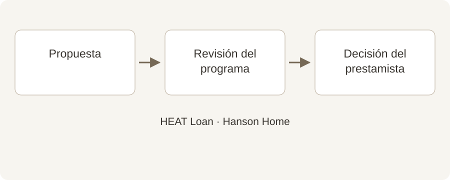

# ¿Está pensando en un HEAT Loan? Empiece antes de instalar

**Draft — unpublished · Español · reviewed October 2, 2026**

Una guía sencilla para coordinar la financiación antes de fijar la instalación.

Es tentador elegir primero la fecha de instalación y resolver la financiación después. Si quiere utilizar el HEAT Loan de Mass Save, reserve tiempo para los trámites desde el principio. Una pequeña coordinación puede evitar problemas de calendario.

## Resumen rápido

- Inicie la revisión del programa antes de instalar.
- La autorización del programa y la aprobación bancaria son pasos distintos.
- Acuerde las fechas de pago antes de programar el trabajo.

## Siga el orden adecuado

Ilustración original de Hanson Home. La revisión del HEAT Loan y la decisión del prestamista son pasos distintos; confirme ambos antes de programar. [Image credit / source: Hanson Home](https://www.myheatloan.com/)

El portal oficial del HEAT Loan indica que se presenta la información del proyecto para recibir un formulario de autorización destinado a un prestamista participante. Las preguntas frecuentes de Mass Save señalan que no se puede solicitar un nuevo HEAT Loan para trabajos ya instalados.

Antes de aceptar una fecha, pregunte qué documentos hacen falta y quién los presenta. Guarde juntos el presupuesto firmado más reciente y los datos de los equipos para evitar que se revise una versión antigua.

Source: [Mass Save: HEAT Loan Portal](https://www.myheatloan.com/)

Source: [Mass Save: HEAT Loan FAQs](https://www.masssave.com/frequently-asked-questions)

## Entienda las dos aprobaciones

El programa revisa si el trabajo cumple sus requisitos. El banco o la cooperativa de crédito participante decide sobre el préstamo según sus propios criterios. Recibir una autorización no significa que el préstamo esté aprobado.

Elija una entidad de la lista oficial y pregunte por los siguientes pasos. Confirme directamente los plazos, la forma de pago y cualquier requisito de afiliación.

Source: [Mass Save: HEAT Loan FAQs](https://www.masssave.com/frequently-asked-questions)

Source: [Mass Save: Participating HEAT Loan Lenders](https://www.masssave.com/residential/rebates-offers-services/financing/heat-loan-lender-list)

## Aclare cuándo tendrá que pagar

Pida el precio del proyecto por escrito, los incentivos estimados por separado y un calendario de pagos. Después confirme con el programa y la entidad qué importe puede financiarse según las reglas vigentes.

En Hanson Home recomendamos poner en una misma hoja la fecha del depósito, la disponibilidad del préstamo y la instalación prevista. Si cambia alguna condición, revise el calendario antes de iniciar el trabajo.

## Haga cuatro preguntas antes de reservar

¿Qué aprobación falta? ¿Qué ocurre si la financiación tarda más? ¿Cuándo vence cada pago? ¿Quién entrega la documentación final?

Conserve el presupuesto, la autorización y las instrucciones de la entidad. Revise las reglas oficiales cuando esté listo para avanzar. Este artículo no garantiza la elegibilidad ni un importe de préstamo concreto.

## Hable con Hanson Home

Avise a Hanson Home desde el principio si desea solicitar un HEAT Loan. Podemos ayudar a organizar el presupuesto de equipos y la instalación mientras confirma la financiación con el programa y el prestamista.

## Fuentes

- [Mass Save: HEAT Loan Portal](https://www.myheatloan.com/)
- [Mass Save: HEAT Loan FAQs](https://www.masssave.com/frequently-asked-questions)
- [Mass Save: Participating HEAT Loan Lenders](https://www.masssave.com/residential/rebates-offers-services/financing/heat-loan-lender-list)
