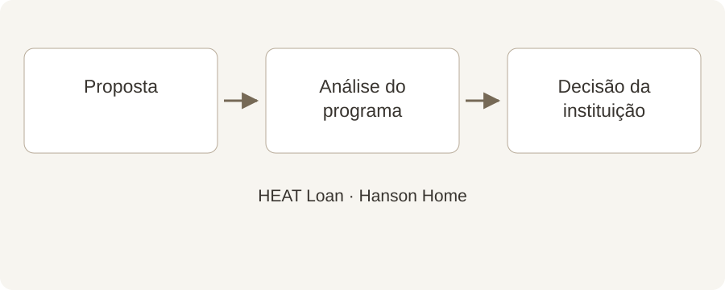

# Pensando em um HEAT Loan? Comece antes da instalação

**Draft — unpublished · Português · reviewed October 2, 2026**

Um guia simples para coordenar o financiamento antes de marcar o serviço.

É tentador escolher a data da instalação e deixar o financiamento para depois. Se pretende usar o HEAT Loan da Mass Save, reserve tempo para os documentos desde o início. Um pouco de coordenação pode evitar problemas de prazo.

## Resumo rápido

- Inicie a análise do programa antes da instalação.
- A autorização do programa e a aprovação do banco são etapas diferentes.
- Combine as datas de pagamento antes de agendar.

## Siga a ordem correta

Ilustração original da Hanson Home. A análise do HEAT Loan e a decisão da instituição são etapas distintas; confirme ambas antes de agendar. [Image credit / source: Hanson Home](https://www.myheatloan.com/)

O portal oficial do HEAT Loan orienta o envio dos dados do projeto para obter um formulário de autorização destinado a uma instituição participante. As perguntas frequentes da Mass Save informam que serviços já instalados não podem ser financiados por uma nova solicitação.

Antes de aceitar uma data, pergunte quais documentos são necessários e quem os envia. Mantenha juntos o orçamento assinado mais recente e os dados dos equipamentos para que a análise use o escopo atualizado.

Source: [Mass Save: HEAT Loan Portal](https://www.myheatloan.com/)

Source: [Mass Save: HEAT Loan FAQs](https://www.masssave.com/frequently-asked-questions)

## Entenda as duas aprovações

O programa analisa a elegibilidade do serviço. O banco ou a cooperativa de crédito participante decide sobre o empréstimo conforme suas próprias exigências. Receber a autorização não significa que o empréstimo foi aprovado.

Escolha uma instituição da lista oficial e pergunte pelos próximos passos. Confirme diretamente os prazos, a forma de pagamento e eventuais requisitos de associação.

Source: [Mass Save: HEAT Loan FAQs](https://www.masssave.com/frequently-asked-questions)

Source: [Mass Save: Participating HEAT Loan Lenders](https://www.masssave.com/residential/rebates-offers-services/financing/heat-loan-lender-list)

## Deixe o fluxo de pagamentos claro

Peça o preço do projeto por escrito, os incentivos estimados separados e um cronograma de pagamentos. Depois confirme com o programa e a instituição qual valor pode ser financiado pelas regras atuais.

Na Hanson Home, recomendamos reunir a data do sinal, a liberação dos recursos e a instalação prevista em uma página. Se alguma condição mudar, revise o calendário antes do início do serviço.

## Faça quatro perguntas antes de agendar

Qual aprovação ainda falta? O que acontece se o financiamento demorar? Quando vence cada pagamento? Quem entrega a documentação de conclusão?

Guarde o orçamento, a autorização e as instruções da instituição. Confira novamente as regras oficiais quando estiver pronto para avançar. Este artigo não garante elegibilidade nem um valor específico de empréstimo.

## Converse com a Hanson Home

Avise a Hanson Home desde o início se pretende solicitar um HEAT Loan. Podemos organizar a proposta de equipamentos e a conversa sobre instalação enquanto você confirma o financiamento com o programa e a instituição.

## Fontes

- [Mass Save: HEAT Loan Portal](https://www.myheatloan.com/)
- [Mass Save: HEAT Loan FAQs](https://www.masssave.com/frequently-asked-questions)
- [Mass Save: Participating HEAT Loan Lenders](https://www.masssave.com/residential/rebates-offers-services/financing/heat-loan-lender-list)
