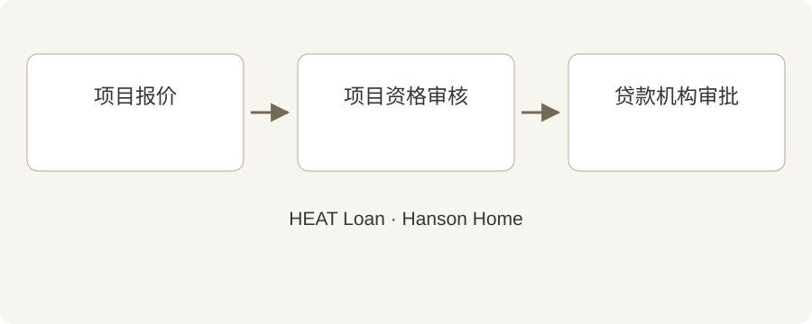

# 考虑申请 HEAT Loan？请在安装前开始办理

**Draft — unpublished · 中文 · reviewed October 2, 2026**

用一个简单的时间安排，把融资手续放在安装日程之前。

先订安装日期、再慢慢办理贷款，看起来很方便。但如果您计划使用 Mass Save HEAT Loan，就应该尽早安排申请材料。提前沟通，可以避免不必要的时间冲突。

## 快速摘要

- 在施工安装前启动项目审核。
- 项目授权和银行贷款审批是不同步骤。
- 安排施工前，先确认付款时间。

## 先弄清办理顺序

Hanson Home 原创示意图。HEAT Loan 项目审核与贷款机构审批是不同步骤；安排施工前，请确认两者。 [Image credit / source: Hanson Home](https://www.myheatloan.com/)

HEAT Loan 官方申请平台要求提交项目资料，符合条件后取得授权表，再向参与项目的贷款机构申请。Mass Save 常见问题说明，已经安装完成的工程不能通过新的 HEAT Loan 申请融资。

接受开工日期前，问清需要哪些文件、由谁提交。把最新签字报价和设备资料放在一起，避免项目改了，融资审核却还在使用旧版本。

Source: [Mass Save: HEAT Loan Portal](https://www.myheatloan.com/)

Source: [Mass Save: HEAT Loan FAQs](https://www.masssave.com/frequently-asked-questions)

## 理解两个不同的审批

项目方审核工程是否符合条件；参与项目的银行或信用合作社根据自己的要求决定是否批准贷款。拿到授权表，并不等于贷款已经获批。

从官方名单选择贷款机构，直接询问后续步骤、期限、付款方式，以及是否需要成为该机构的会员。

Source: [Mass Save: HEAT Loan FAQs](https://www.masssave.com/frequently-asked-questions)

Source: [Mass Save: Participating HEAT Loan Lenders](https://www.masssave.com/residential/rebates-offers-services/financing/heat-loan-lender-list)

## 把资金安排写清楚

请安装商提供书面项目价格、单独列出的预计优惠，以及付款时间表。随后向项目方和贷款机构确认，按现行规则可以融资多少。

Hanson Home 建议把订金日期、资金到位日期和预计安装日期写在一张纸上。如果其中某个前提发生变化，开工前就重新确认日程。

## 预约前问四个问题

还有哪个审批没完成？资金晚到怎么办？每笔款项什么时候付？完工资料由谁提交？

保存好报价、授权表和贷款机构的说明。准备推进时，再核对官方规则。本文不保证申请资格，也不承诺具体贷款金额。

## 与 Hanson Home 聊聊您的计划

如果打算申请 HEAT Loan，请尽早告诉 Hanson Home。我们可以协助整理设备报价和安装安排，融资资格与贷款审批则请向项目方及贷款机构确认。

## 参考来源

- [Mass Save: HEAT Loan Portal](https://www.myheatloan.com/)
- [Mass Save: HEAT Loan FAQs](https://www.masssave.com/frequently-asked-questions)
- [Mass Save: Participating HEAT Loan Lenders](https://www.masssave.com/residential/rebates-offers-services/financing/heat-loan-lender-list)
