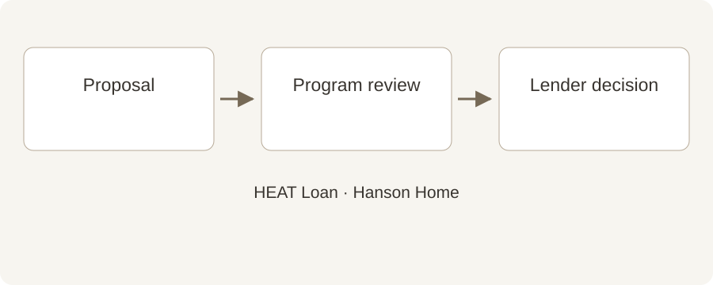

# Thinking About a HEAT Loan? Start Before Installation

**Draft — unpublished · English · reviewed October 2, 2026**

Keep the financing conversation ahead of the installation calendar with this simple planning guide.

It is tempting to pick an installation date first and sort out financing afterward. If you want to use the Mass Save HEAT Loan, put the paperwork on the calendar early. A little coordination can prevent an avoidable timing problem.

## Quick summary

- Start the program review before work is installed.
- Program authorization and lender approval are separate steps.
- Agree on payment dates before scheduling.

## Get the order right

Original Hanson Home illustration. The HEAT Loan program review and lender decision are separate steps; confirm both before scheduling work. [Image credit / source: Hanson Home](https://www.myheatloan.com/)

The official HEAT Loan portal directs customers to submit eligible project information and obtain an Authorization Form for a participating lender. Mass Save’s FAQ says already-installed work cannot be financed through a new HEAT Loan application.

Before accepting a start date, ask which documents are needed and who submits them. Keep the latest signed proposal and equipment details together so a revision does not leave the financing team working from an old scope.

Source: [Mass Save: HEAT Loan Portal](https://www.myheatloan.com/)

Source: [Mass Save: HEAT Loan FAQs](https://www.masssave.com/frequently-asked-questions)

## Understand the two approvals

The program reviews the work for eligibility. The participating bank or credit union makes the lending decision under its own requirements. Receiving an authorization does not mean your loan is approved.

Choose a lender from the official list and ask what happens next. Confirm its deadlines, payment method and any membership requirements directly with that lender.

Source: [Mass Save: HEAT Loan FAQs](https://www.masssave.com/frequently-asked-questions)

Source: [Mass Save: Participating HEAT Loan Lenders](https://www.masssave.com/residential/rebates-offers-services/financing/heat-loan-lender-list)

## Make the cash-flow plan visible

Ask for a written project price, estimated incentives shown separately and a payment schedule. Then ask the program and lender what amount can be financed under the current rules.

At Hanson Home, we recommend putting the deposit date, funding date and expected installation date on one page. If an assumption changes, revisit the schedule before work begins.

## Ask four questions before booking

Which approval is still pending? What happens if funding takes longer? When is each payment due? Who handles the completion documentation?

Keep copies of the proposal, authorization and lender instructions. Program rules can change, so recheck the official guidance when you are ready to proceed. This article does not promise eligibility or a particular loan amount.

## Talk with Hanson Home

Tell Hanson Home early if you plan to pursue a HEAT Loan. We can help organize the equipment proposal and installation discussion while you confirm financing with the program and lender.

## Sources

- [Mass Save: HEAT Loan Portal](https://www.myheatloan.com/)
- [Mass Save: HEAT Loan FAQs](https://www.masssave.com/frequently-asked-questions)
- [Mass Save: Participating HEAT Loan Lenders](https://www.masssave.com/residential/rebates-offers-services/financing/heat-loan-lender-list)
