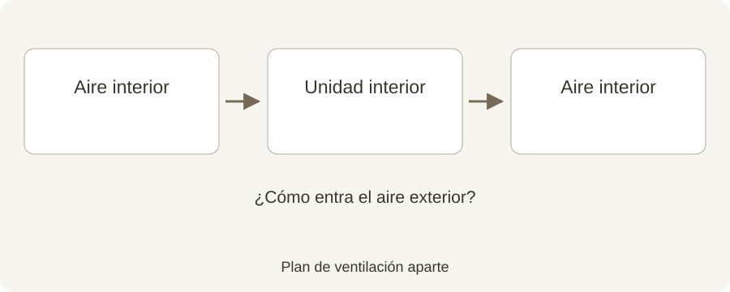

# ¿Un mini-split introduce aire fresco en su vivienda?

**Draft — unpublished · Español · reviewed October 2, 2026**

Calefacción, refrigeración, filtración y ventilación cumplen funciones diferentes. Esta es la explicación sencilla.

Una habitación puede sentirse más cálida o fresca sin recibir más aire exterior. Es un detalle fácil de pasar por alto al elegir un mini-split. Entender por dónde circula el aire ayuda a preguntar mejor sobre confort y ventilación.

## Resumen rápido

- Un mini-split de pared típico recircula aire de la habitación.
- Limpiar un filtro e introducir aire exterior son tareas distintas.
- Pregunte cómo se ventila su vivienda.

Instalación real en una vivienda de cliente de Hanson Home. Foto: Hanson Home.

## Siga el recorrido del aire

Ilustración original de Hanson Home del recorrido típico del aire en un mini-split. Pregunte por el sistema de aire exterior o ventilación. [Image credit / source: Hanson Home](https://www.epa.gov/indoor-air-quality-iaq/improving-indoor-air-quality)

En un mini-split de pared típico, el aire de la habitación atraviesa la unidad interior y vuelve al mismo espacio. La unidad exterior intercambia calor mediante el refrigerante; su presencia no implica que exista un conducto de aire exterior hacia el dormitorio. Algunos productos tienen funciones específicas de aire fresco: revise el modelo concreto.

Pregunte directamente: «¿Por dónde entra el aire exterior en este diseño?». Si depende de otro sistema, pida que también se explique en el proyecto.

Source: [US EPA: Improving Indoor Air Quality](https://www.epa.gov/indoor-air-quality-iaq/improving-indoor-air-quality)

## Entienda la función del filtro

La EPA explica que la filtración complementa el control de fuentes contaminantes y la ventilación, pero no elimina todos los contaminantes. Un filtro limpio es un buen mantenimiento; no constituye un plan completo de renovación de aire.

Siga el manual para limpiarlo. Si quiere más purificación, pregunte qué filtra realmente el dispositivo propuesto, sin suponer que todas las funciones de «calidad del aire» son iguales.

Source: [US EPA: Air Cleaners and Air Filters in the Home](https://www.epa.gov/indoor-air-quality-iaq/air-cleaners-and-air-filters-home)

## Empiece por la rutina diaria

La EPA señala que los extractores de cocina y baño con salida al exterior ayudan a retirar contaminantes en su origen. Abrir ventanas también puede ventilar cuando las condiciones exteriores son adecuadas.

Piense en la cocina, las duchas, las visitas y las puertas cerradas. Comente dónde permanecen los olores o el aire parece cargado. Son observaciones útiles para iniciar la conversación sin intentar diagnosticar el problema.

Source: [US EPA: Improving Indoor Air Quality](https://www.epa.gov/indoor-air-quality-iaq/improving-indoor-air-quality)

## Incluya la ventilación en el presupuesto

En una reforma o una vivienda más hermética, pregunte si la ventilación actual es adecuada y si requiere la revisión de un especialista. Si se propone ventilación mecánica, consulte cómo se usa y mantiene.

Hanson Home recomienda hablar del confort térmico y del aire fresco en la misma conversación. Conviene saber qué hace cada sistema y a quién llamar si necesita servicio.

## Hable con Hanson Home

¿Planea instalar mini-splits? Consulte con Hanson Home la distribución de habitaciones y el recorrido del aire, e incluya sus preguntas de ventilación en el proyecto.

## Fuentes

- [US EPA: Improving Indoor Air Quality](https://www.epa.gov/indoor-air-quality-iaq/improving-indoor-air-quality)
- [US EPA: Air Cleaners and Air Filters in the Home](https://www.epa.gov/indoor-air-quality-iaq/air-cleaners-and-air-filters-home)
