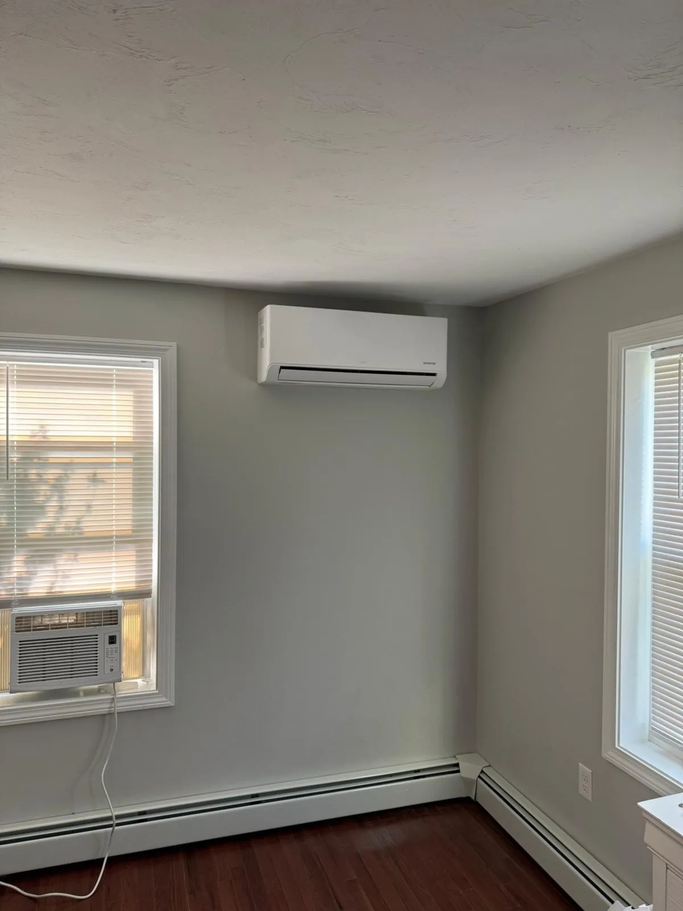

# Um mini-split traz ar fresco para dentro de casa?

**Draft — unpublished · Português · reviewed October 2, 2026**

Aquecer, resfriar, filtrar e ventilar são funções diferentes. Entenda a distinção.

Um cômodo pode ficar mais quente ou mais fresco sem receber mais ar externo. Esse detalhe passa despercebido ao escolher um mini-split. Entender o caminho do ar ajuda a conversar sobre conforto e ventilação.

## Resumo rápido

- Um mini-split de parede típico recircula o ar do cômodo.
- Limpar um filtro e trazer ar externo são tarefas diferentes.
- Pergunte como a ventilação da casa é feita.

Instalação real em uma residência de cliente da Hanson Home. Foto: Hanson Home.

## Siga o caminho do ar

Ilustração original da Hanson Home do caminho típico do ar em um mini-split. Pergunte pelo sistema de ar externo ou ventilação. [Image credit / source: Hanson Home](https://www.epa.gov/indoor-air-quality-iaq/improving-indoor-air-quality)

Em um mini-split de parede típico, o ar do cômodo passa pela unidade interna e volta ao mesmo ambiente. A unidade externa troca calor pelo sistema de refrigerante; isso não significa que exista um duto trazendo ar externo ao quarto. Alguns produtos têm recursos específicos de renovação de ar: confira o modelo exato.

Pergunte diretamente: “Por onde entra o ar externo neste projeto?”. Se a resposta envolver outro sistema, peça que ele também seja explicado na proposta.

Source: [US EPA: Improving Indoor Air Quality](https://www.epa.gov/indoor-air-quality-iaq/improving-indoor-air-quality)

## Entenda a função do filtro

A EPA explica que a filtragem complementa o controle das fontes de poluição e a ventilação, mas não remove todos os poluentes. Limpar o filtro da unidade interna é uma boa manutenção; a renovação do ar precisa ser considerada separadamente.

Siga o manual para a limpeza. Se deseja purificação adicional, pergunte o que o equipamento proposto realmente filtra. Os recursos anunciados como “qualidade do ar” podem ter funções diferentes.

Source: [US EPA: Air Cleaners and Air Filters in the Home](https://www.epa.gov/indoor-air-quality-iaq/air-cleaners-and-air-filters-home)

## Comece pela rotina da casa

A EPA destaca que exaustores de cozinha e banheiro com saída para fora ajudam a remover poluentes na origem. Abrir janelas também pode ventilar quando as condições externas são adequadas.

Pense em cozinhar, tomar banho, receber visitas e manter portas fechadas. Conte onde os odores persistem ou o ar parece abafado. São observações úteis para iniciar a conversa sem tentar diagnosticar a causa.

Source: [US EPA: Improving Indoor Air Quality](https://www.epa.gov/indoor-air-quality-iaq/improving-indoor-air-quality)

## Inclua a ventilação na proposta

Em uma reforma ou casa mais vedada, pergunte se a ventilação existente é adequada e se precisa da avaliação de um especialista. Se houver proposta de ventilação mecânica, pergunte como operá-la e mantê-la.

A Hanson Home recomenda discutir conforto térmico e ar fresco juntos. Você deve entender a função de cada sistema e quem contatar se precisar de assistência.

## Converse com a Hanson Home

Vai instalar mini-splits? Converse com a Hanson Home sobre a distribuição dos cômodos e o caminho do ar, incluindo suas dúvidas sobre ventilação no projeto.

## Fontes

- [US EPA: Improving Indoor Air Quality](https://www.epa.gov/indoor-air-quality-iaq/improving-indoor-air-quality)
- [US EPA: Air Cleaners and Air Filters in the Home](https://www.epa.gov/indoor-air-quality-iaq/air-cleaners-and-air-filters-home)
