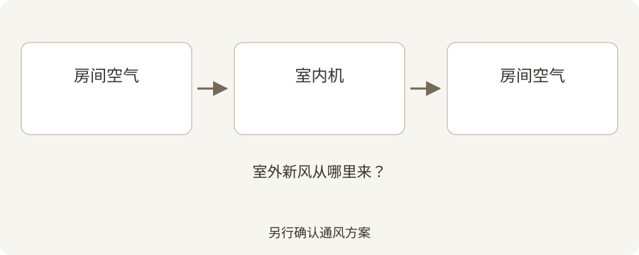

# 壁挂式热泵会给家里送新风吗？

**Draft — unpublished · 中文 · reviewed October 2, 2026**

供暖、制冷、过滤和通风各有作用，先把这几个概念分清楚。

房间变暖或变凉，并不代表室外新风增加了。选购壁挂式热泵时，这一点很容易被忽略。了解空气从哪里来、到哪里去，就更容易讨论舒适度和通风。

## 快速摘要

- 常见壁挂式室内机循环的是房间里的空气。
- 清洗滤网和引入室外新风是两件事。
- 请安装商解释您家的通风安排。

Hanson Home 客户住宅的实际安装照片。摄影：Hanson Home。

## 先看空气的路线

Hanson Home 原创示意图，说明常见壁挂式热泵的空气路线。请单独确认室外新风和通风系统。 [Image credit / source: Hanson Home](https://www.epa.gov/indoor-air-quality-iaq/improving-indoor-air-quality)

常见壁挂式室内机吸入房间空气，经过处理后再送回房间。室外机通过制冷剂系统交换热量；有室外机，不等于有一根向卧室输送室外空气的风管。部分产品有独立的新风功能，需要核对具体型号。

可以直接问安装商：“这个方案里，室外空气从哪里进入？”如果依靠另一个系统，请把那个系统也纳入项目说明。

Source: [US EPA: Improving Indoor Air Quality](https://www.epa.gov/indoor-air-quality-iaq/improving-indoor-air-quality)

## 理解滤网能做什么

美国环保署 EPA 说明，过滤可以辅助污染源控制和通风，但不能去除所有污染物。保持室内机滤网清洁是良好的维护习惯，还需要单独考虑新风和通风。

按设备说明书清洁滤网。如果希望增加空气净化功能，问清拟选设备实际过滤什么，不要把所有“空气质量”功能都当成同一种能力。

Source: [US EPA: Air Cleaners and Air Filters in the Home](https://www.epa.gov/indoor-air-quality-iaq/air-cleaners-and-air-filters-home)

## 从日常生活聊起

EPA 指出，排气到室外的厨房和浴室风机有助于在源头排走污染物。室外条件适合时，开窗也能帮助通风。

想想做饭、洗澡、来客和关门休息的日常场景。告诉安装商哪里容易留有气味、哪里感觉空气闷。这些观察有助于展开讨论，不需要您自己判断故障原因。

Source: [US EPA: Improving Indoor Air Quality](https://www.epa.gov/indoor-air-quality-iaq/improving-indoor-air-quality)

## 把通风写进方案讨论

装修或提高房屋气密性时，请询问现有通风是否适合，是否需要专业人员进一步检查。如果建议机械通风，问清怎样使用和维护。

Hanson Home 建议同时讨论温度舒适度和新风需求。您应该知道各个系统的作用，以及需要维修时联系谁。

## 与 Hanson Home 聊聊您的计划

准备安装壁挂式热泵？欢迎与 Hanson Home 讨论房间布局和空气路线，并把通风问题一起带进安装方案。

## 参考来源

- [US EPA: Improving Indoor Air Quality](https://www.epa.gov/indoor-air-quality-iaq/improving-indoor-air-quality)
- [US EPA: Air Cleaners and Air Filters in the Home](https://www.epa.gov/indoor-air-quality-iaq/air-cleaners-and-air-filters-home)
