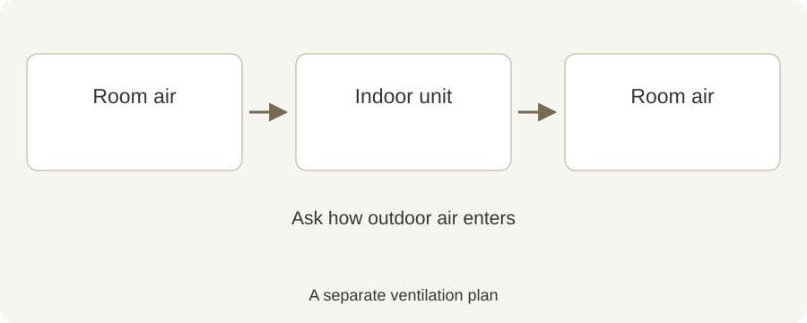

# Does a Mini-Split Bring Fresh Air Into Your Home?

**Draft — unpublished · English · reviewed October 2, 2026**

Heating, cooling, filtration and ventilation do different jobs. Here is the simple distinction.

A room can feel warmer or cooler without receiving more outdoor air. That is an easy detail to miss when shopping for a mini-split. Understanding the air path helps you ask better questions about both comfort and ventilation.

## Quick summary

- A typical wall-mounted mini-split recirculates room air.
- Cleaning a filter and bringing in outdoor air are different tasks.
- Ask how ventilation is handled in your home.

Real Hanson Home client-site installation. Photo: Hanson Home.

## Follow the air path

Original Hanson Home illustration of a typical mini-split air path. Ask about any separate outdoor-air or ventilation system. [Image credit / source: Hanson Home](https://www.epa.gov/indoor-air-quality-iaq/improving-indoor-air-quality)

In a typical wall-mounted mini-split, room air passes through the indoor unit and returns to the room. The outdoor unit exchanges heat through the refrigerant system; its presence does not mean there is an outdoor-air duct to your bedroom. Some products have separate fresh-air features, so check the exact model.

Ask the installer a straightforward question: “Where does outdoor air enter this design?” If the answer involves another system, ask that it be included in the explanation of the project.

Source: [US EPA: Improving Indoor Air Quality](https://www.epa.gov/indoor-air-quality-iaq/improving-indoor-air-quality)

## Give filters the right job

EPA explains that filtration can supplement pollution-source control and ventilation, but filters do not remove every pollutant. A clean indoor-unit filter is useful maintenance; it is not a complete fresh-air plan.

Follow your equipment manual for cleaning. If you want additional air cleaning, ask what the proposed device actually filters rather than assuming every “air quality” feature does the same thing.

Source: [US EPA: Air Cleaners and Air Filters in the Home](https://www.epa.gov/indoor-air-quality-iaq/air-cleaners-and-air-filters-home)

## Start with the everyday routine

EPA identifies outdoor-vented kitchen and bathroom fans as useful ways to remove pollutants at their source. Opening windows can also provide ventilation when outdoor conditions are appropriate.

Think about your own routine: cooking, showers, visitors and rooms with closed doors. Tell the installer where odors linger or the air feels stale. Those observations help frame the ventilation conversation without guessing at a diagnosis.

Source: [US EPA: Improving Indoor Air Quality](https://www.epa.gov/indoor-air-quality-iaq/improving-indoor-air-quality)

## Make ventilation part of the proposal

For a renovation or a tighter home, ask whether the existing ventilation is suitable and whether a specialist should review it. If mechanical ventilation is proposed, ask how it is operated and maintained.

Hanson Home recommends discussing temperature comfort and fresh air together. You should understand what each system does and who to contact if it needs service.

## Talk with Hanson Home

Planning mini-splits? Ask Hanson Home about the room layout and air path, and bring any ventilation questions into the installation discussion.

## Sources

- [US EPA: Improving Indoor Air Quality](https://www.epa.gov/indoor-air-quality-iaq/improving-indoor-air-quality)
- [US EPA: Air Cleaners and Air Filters in the Home](https://www.epa.gov/indoor-air-quality-iaq/air-cleaners-and-air-filters-home)
