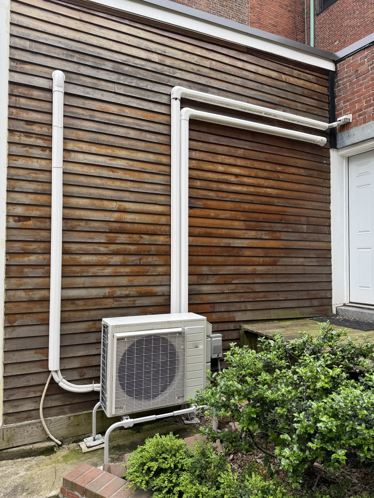

# Una instalación más silenciosa empieza por la ubicación de la unidad exterior

**Draft — unpublished · Español · reviewed October 2, 2026**

Cuatro preguntas sobre ventanas, soportes y los espacios alrededor de la unidad.

Convivirá con la ubicación de la unidad exterior mucho después de instalarla. Antes de elegirla, recorra la zona con el instalador. Hablar del sonido y del uso diario de la casa ayuda a encontrar un lugar adecuado.

## Resumen rápido

- Comente la ubicación de dormitorios, patios y vecinos.
- Pida datos acústicos del modelo concreto.
- Revise los soportes y el acceso dentro del mismo plan.

Instalación real en una vivienda de cliente de Hanson Home. Foto: Hanson Home.

## Mire más allá de la pared más cómoda

Señale las ventanas de dormitorios, las zonas donde se sienta al aire libre y las ventanas cercanas de vecinos. Pida que se explique cómo se relaciona la ubicación propuesta con esos espacios.

En Hanson Home recomendamos revisar desde dentro y desde fuera. El recorrido de tuberías importa; también importa cómo utiliza su vivienda.

## Pregunte qué significa la cifra de sonido

Si se indican decibelios, pregunte si son potencia o presión sonora y en qué condiciones se midieron. Compare información equivalente de los modelos concretos.

Pregunte si cambia el funcionamiento entre un día templado y un día invernal exigente. Una cifra anunciada como «silenciosa» no garantiza lo que se oirá en cada ventana.

## Revise el tipo de soporte

La guía de instalación de PNNL incluye el ruido entre los factores de diseño y señala posibles vibraciones cuando la unidad se fija a una pared. Pregunte si el soporte es adecuado para el lugar elegido.

Revise también las distancias necesarias, la nieve, el drenaje y el acceso de servicio. No añada un cerramiento decorativo sin que el instalador lo compruebe con las instrucciones del equipo.

Source: [PNNL: Ductless Mini-Split Heat Pumps](https://basc.pnnl.gov/resource-guides/ductless-mini-split-heat-pumps)

## Termine con un recorrido

Antes de aprobar, sitúese en el lugar propuesto: ¿se podrá dar servicio?, ¿adónde irá el agua?, ¿qué espacios cercanos podrían oírlo? Confirme con el instalador los requisitos locales de ubicación y ruido.

Pida que la ubicación y el soporte acordados figuren en el alcance escrito. Si aparecen vibraciones o traqueteos inusuales, solicite una revisión en lugar de darlos por normales.

## Hable con Hanson Home

Pida a Hanson Home que revise con usted las posibles ubicaciones. Incluya sus prioridades para dormitorios, espacios exteriores y vecinos en la conversación sobre equipos e instalación.

## Fuentes

- [PNNL: Ductless Mini-Split Heat Pumps](https://basc.pnnl.gov/resource-guides/ductless-mini-split-heat-pumps)
